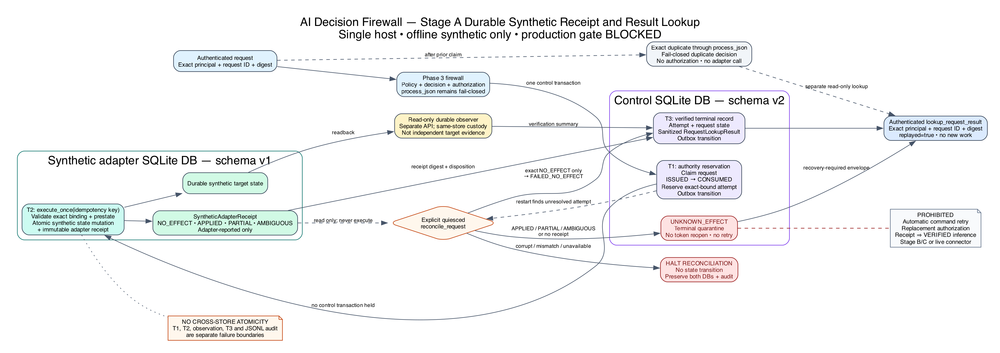

# AI Decision Firewall

AI Decision Firewall is a reference implementation of a control boundary
between AI-assisted analysis and consequential action. The model is advisory:
deterministic evidence checks, policy, and a functionally separate same-project
verifier decide whether scoped authorization may be issued. Post-action
observation records whether the intended effect was observed. All included data
and demonstrated effects are offline and synthetic.

> [!WARNING]
> This repository is not authorized for production integration, operational
> decision-making, or live containment. It includes no live connector,
> operational credential, external target, or approved historical dataset.

**[Explore the public project website and interactive synthetic decision
demonstration](https://redxking.github.io/ai-decision-firewall/)** or download
the [current developer prerelease](https://github.com/redxking/ai-decision-firewall/releases/tag/v0.4.0-alpha.2).

## Current status

| Item | Status |
|---|---|
| Developer prerelease | [`v0.4.0-alpha.2`](https://github.com/redxking/ai-decision-firewall/releases/tag/v0.4.0-alpha.2), published 2026-08-20 from exact commit [`d5c15719`](https://github.com/redxking/ai-decision-firewall/commit/d5c1571930a29d78b31210c219465ecc4d1a793a) |
| Public website | [Evidence-gated interactive synthetic demonstration](https://redxking.github.io/ai-decision-firewall/), deployed from the immutable `v0.4.0-alpha.2` release source; it is not an operational service |
| Stage A production-development merge | [`db7d6e6d`](https://github.com/redxking/ai-decision-firewall/commit/db7d6e6d3bea59bc8579c1e198a236a541f65d86) |
| Bound implementation / carrier | [`91a35145`](https://github.com/redxking/ai-decision-firewall/commit/91a351459610e045ae5de7b9380f8228c157006f) / [`a5046f38`](https://github.com/redxking/ai-decision-firewall/commit/a5046f38b229b5899baf399143b13c20c1101aae) |
| Production gate | `BLOCKED`: 18 domains, 36 mandatory requirements all blocking, 36/36 owner acceptances `NOT_RECORDED` |
| Included data and executed effects | Offline and synthetic only |
| Model promotion | `NOT_AUTHORIZED` |
| Main verification | [CI run 32399958311](https://github.com/redxking/ai-decision-firewall/actions/runs/32399958311) passed Python 3.11, Python 3.12, and the restricted container build at exact merge commit [`8fa39dfa`](https://github.com/redxking/ai-decision-firewall/commit/8fa39dfadea270ad96d312b48bda8da403806ee8); production approval remains blocked |

## What the project does

- validates contract conformance for typed evidence and its declared provenance,
  freshness, integrity, corroboration, conflicts, and source authority;
- uses a deterministic logistic-risk model as one advisory input;
- uses deterministic policy to select a bounded disposition or require human
  escalation;
- requires a separate deterministic verification step before authorization;
- binds authorization to the exact principal, request, decision, action,
  target, parameters, prestate, policy, and expiry;
- records adapter acknowledgement and same-project readback as separate facts,
  neither of which is independently custodied effect proof; and
- records lifecycle evidence in a SHA-256 hash-chained audit log.

The model has no signing key, target credential, broker reference, or direct
execution path.

## Implemented boundaries

| Increment | Implemented scope | Explicit boundary |
|---|---|---|
| Phase 1 | Frozen synthetic privileged-identity decision transaction | Historical compatibility baseline; not current production evidence |
| [Phase 2](docs/phase2/README.md) | Offline replay, record qualification, Gate B preflight, and separate reference calculations | Read-only; zero historical cases included. `P2-CE-005` remains CE-0 `NOT_EVALUATED` |
| [Phase 3](docs/phase3/README.md) | Raw request-to-effect simulation, scoped authorization, broker, and readback | In-memory synthetic target only; no live connector |
| [Phase 3.1](docs/phase31/README.md) | Synthetic temporal model evaluation and calibration comparison | Promotion remains `NOT_AUTHORIZED` |
| Stage A | Durable request, authorization, receipt, recovery, and sanitized result lookup | Opt-in, same-host, offline synthetic mechanism; production remains `BLOCKED` |
| [Phase 4 lab foundation](contracts/v0.4.0/README.md) | Closed authenticated executor/observer handlers, durable replay fencing, Linux `SOCK_SEQPACKET` peer checks, and an opt-in disposable internal-network container harness | Executor remains pre-effect `NO_EFFECT`; no target mutation, live connector, external route, or action authority |

## Stage A architecture



Stage A uses three distinct local artifacts:

1. a control SQLite database for request claims, authorization, attempts,
   terminal results, and the audit outbox;
2. a separate SQLite database for synthetic target state and immutable
   adapter-reported receipts; and
3. the JSONL lifecycle audit.

Reservation and token consumption (`T1`), synthetic adapter mutation and receipt
commit (`T2`), lifecycle-audit closure, and terminal result persistence (`T3`)
are separate boundaries. There is no cross-store atomic transaction. An exact
affirmative `NO_EFFECT` receipt may close `FAILED_NO_EFFECT`; `APPLIED`,
`PARTIAL`, or `AMBIGUOUS` without separately durable verification closes
`UNKNOWN_EFFECT`, as does an absent receipt. Recovery does not automatically
retry a command or issue replacement authority. Corrupt, mismatched, or
unavailable recovery evidence halts without a state transition.

The implementation adds bounded POSIX-cooperative ownership for startup,
durable operations, and audit writes; control and adapter schema, semantic, and
chronology scans; startup and runtime cross-store correlation; and a recovery
audit prefix (`RECOVERY_STARTED`, `RECOVERY_EVIDENCE_ASSESSED`, then
`RECOVERY_FINALIZED`) that fences cooperative writers until terminal
persistence.
Authenticated exact duplicates can use a separate authority-free result lookup;
`process_json` itself remains fail closed on duplicates. These controls do not
protect against a noncooperating same-user writer and do not provide a
distributed lease, epoch, or fence, process isolation, independent evidence
custody, HA, DR, or a production adapter. See
[ADR-015](docs/adr/015_durable_synthetic_adapter_receipt_and_result_lookup.md)
and the [Stage A runbook](docs/operations/STAGE_A_DURABLE_LEDGER_RUNBOOK.md) for
the exact transaction and recovery contract.

The successor development tree also includes a fail-closed cold backup/restore
mechanism for the exact three-artifact set. It validates a closed digest/size
manifest, config/policy/secret bindings, store identities, audit continuity,
and cross-store correlation before creating a new inode-bound service marker.
It is self-custodied local recoverability mechanics, not DR, rollback
resistance, trusted time, continuous backup, or RPO/RTO evidence. See the
[cold backup/restore runbook](docs/operations/STAGE_A_BACKUP_RESTORE_RUNBOOK.md).

## Quick start

### Playable Stage A developer preview

After installing the locked dependencies below, run the durable synthetic
preview with one command:

```bash
PYTHONDONTWRITEBYTECODE=1 PYTHONPATH=src:. python3 run_preview.py demo
```

The command creates owner-private state under
`outputs/local/stage-a-preview`, runs a workstation case and a Tier 0 domain
controller case through the real Stage A service boundary, prints only the
sanitized result contract, and verifies the audit chain. It opens no listener,
uses no live connector or credential, and cannot affect an external target.

Inspect, continue, or explicitly reset the same preview state:

```bash
PYTHONDONTWRITEBYTECODE=1 PYTHONPATH=src:. python3 run_preview.py status
PYTHONDONTWRITEBYTECODE=1 PYTHONPATH=src:. python3 run_preview.py scenario workstation
PYTHONDONTWRITEBYTECODE=1 PYTHONPATH=src:. python3 run_preview.py generate workstation \
  --output /tmp/adf-preview-request.json
PYTHONDONTWRITEBYTECODE=1 PYTHONPATH=src:. python3 run_preview.py submit \
  --file /tmp/adf-preview-request.json
PYTHONDONTWRITEBYTECODE=1 PYTHONPATH=src:. python3 run_preview.py reset \
  --confirm-synthetic-preview
```

Docker users can run the same demo in a networkless, read-only, capability-free
container. Its preview state is intentionally ephemeral:

```bash
./scripts/run_preview_container.sh
```

See the [developer preview guide](docs/DEVELOPER_PREVIEW.md) for expected
outcomes, persistence boundaries, and tester feedback requests.

Requirements: Python 3.11 or later, NumPy, and jsonschema. The commands below
use a Linux/macOS shell; the Stage A durable path requires POSIX cooperative
locking.

```bash
git clone https://github.com/redxking/ai-decision-firewall.git
cd ai-decision-firewall

python3 -m venv .venv
source .venv/bin/activate
python -m pip install --require-hashes --only-binary=:all: -r requirements.lock
```

The install is intentionally fail closed: it accepts only distributions whose
SHA-256 digests are in the reviewed runtime lock, and it will not execute an
sdist build. If the lock has no compatible wheel for the selected interpreter
and platform, stop and review the dependency set rather than weakening either
flag. The Python/pip bootstrap itself remains outside this runtime lock.

Run the Phase 3 synthetic demonstrations:

```bash
demo_dir="$(mktemp -d /tmp/adf-phase3-demo.XXXXXX)"
PYTHONDONTWRITEBYTECODE=1 PYTHONPATH=src:. python3 run_phase3.py \
  --output-dir "$demo_dir"
```

Run the complete test suite with warnings treated as failures:

```bash
PYTHONWARNINGS=error PYTHONDONTWRITEBYTECODE=1 PYTHONPATH=src:. \
  python3 -m unittest discover -s tests
```

Validate the dependency locks, runtime SBOM, and exact tracked-file manifest:

```bash
python3 scripts/validate_supply_chain.py
python3 scripts/validate_manifest.py
```

The manifest validator requires one sorted, canonical entry for every tracked
regular file except `MANIFEST.sha256` itself, rejects duplicate or unsafe
paths, and then verifies every recorded digest. It is an integrity inventory,
not a signature or independently custodied attestation.

Validate the offline Phase 2 package without invoking the decision engine:

```bash
python3 run_phase2.py --validate-only
```

Check the production-readiness control record:

```bash
python3 scripts/validate_production_readiness.py \
  --config config/production_readiness_requirements.json \
  --repo-root .
```

Once a separate schema `0.2.0` metadata carrier names an immutable candidate
commit and that candidate's verified manifest digest, validate the clean carrier
with the stricter ceremony check:

```bash
python3 scripts/validate_production_readiness.py --release-mode \
  --config config/production_readiness_requirements.json \
  --repo-root .
```

Release mode permits the carrier to differ from the named candidate only in the
readiness descriptor and regenerated repository manifest. It still returns
status `2` while mandatory external or owner gates remain blocked.

The readiness command intentionally exits with status `2` while the derived
state is `BLOCKED`. Stage A now includes an explicit-create, existing-state-only
loopback reference service and an offline Kubernetes source baseline. Neither is
an accepted production transport or deployment. Use the
[durable-state runbook](docs/operations/STAGE_A_DURABLE_LEDGER_RUNBOOK.md) and
[Kubernetes runbook](docs/operations/STAGE_A_KUBERNETES_RUNBOOK.md). Cold state
copy/restore is separately bounded by the
[backup/restore runbook](docs/operations/STAGE_A_BACKUP_RESTORE_RUNBOOK.md); do not add
an ad hoc launcher, network endpoint, connector, credential, or external target.

## Exact evidence snapshot

At implementation Commit [`8818d5d2`](https://github.com/redxking/ai-decision-firewall/commit/8818d5d2d40faebced66a254d58b1f0d04c9f8b4):

- focused Stage A tests passed 43/43;
- production-readiness gate tests passed 18/18;
- the warning-fatal repository suite passed 360/360;
- focused Phase 3 tests passed 57/57;
- the adversarial corpus passed 46/46 with `live_actions_possible=false`;
- the implementation manifest verified 307/307;
- Phase 3.1 focused tests passed 11/11 with promotion `NOT_AUTHORIZED`;
- exact-SHA [CI](https://github.com/redxking/ai-decision-firewall/actions/runs/31953570779)
  and [Dependency Graph](https://github.com/redxking/ai-decision-firewall/actions/runs/31953572482)
  runs succeeded; CI covered Python 3.11 and 3.12.

Evidence carrier [`fd6ea593`](https://github.com/redxking/ai-decision-firewall/commit/fd6ea59334ebce8a1c96302f388e9864d7d9780b)
adds the exact [ER-002 evidence record](docs/production/STAGE_A_RECEIPT_RESULT_EVIDENCE_RECORD.md),
verified its own 308-entry manifest 308/308, and passed
[CI on Python 3.11 and 3.12](https://github.com/redxking/ai-decision-firewall/actions/runs/31955611831).
As of 2026-08-16, no exact-carrier Dependency Graph or Pages run was observed,
and no tag, GitHub Release, associated pull request, or deployment was created
for it. Older website tags and releases remain separate from this candidate.

These results are project-controlled implementation observations. They are not
historical or live evaluation, independent verification, operational
effectiveness, owner acceptance, or production authorization. The demonstrations
include one synthetic workstation isolation effect and no live or external
operational effect. Passing 18/18 readiness-validator tests closes no owner gate.

## Safety boundary

The current repository does not establish:

- approval to acquire or process organizational historical data;
- production vendor behavior, identity, key management, credentials, or target
  semantics;
- independently custodied command receipts, observation, audit, or trusted time;
- cross-store atomicity, distributed replay protection, process isolation,
  failover, approved DR/rollback behavior, continuous backup, or
  production-scale behavior;
- historical/live model performance, analyst agreement, or operational error
  rates; or
- suitability for safety-critical, operational-technology, or
  critical-infrastructure control.

The complete control status is maintained in
[Production Readiness](docs/production/PRODUCTION_READINESS.md) and the
[Security and Safety Case](docs/SECURITY_AND_SAFETY_CASE.md).

## Documentation

- [Current engineering status and forward plan](docs/ENGINEERING_STATUS_AND_FORWARD_PLAN.md)
- [Stage A exact evidence record](docs/production/STAGE_A_RECEIPT_RESULT_EVIDENCE_RECORD.md)
- [Production readiness and blocking gates](docs/production/PRODUCTION_READINESS.md)
- [ADR-015: durable synthetic receipt and result lookup](docs/adr/015_durable_synthetic_adapter_receipt_and_result_lookup.md)
- [ADR-016: offline Stage A container boundary](docs/adr/016_offline_stage_a_container_boundary.md)
- [ADR-017: process-isolated non-production adapter lab](docs/adr/017_process_isolated_nonproduction_adapter_lab.md)
- [Stage A inspection and recovery runbook](docs/operations/STAGE_A_DURABLE_LEDGER_RUNBOOK.md)
- [Offline Stage A Kubernetes runbook](docs/operations/STAGE_A_KUBERNETES_RUNBOOK.md)
- [Architecture diagrams and build instructions](docs/architecture/README.md)
- [Phase 2 documentation](docs/phase2/README.md)
- [Phase 3 documentation](docs/phase3/README.md)
- [Phase 3.1 documentation](docs/phase31/README.md)
- [Roadmap and exit conditions](docs/ROADMAP.md)
- [Security policy and vulnerability reporting](SECURITY.md)

## Licensing

No open-source license is included. Public availability does not grant
permission to use, modify, or redistribute this work.
