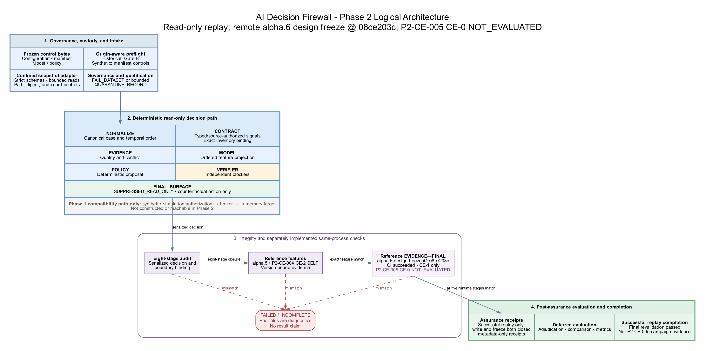

# AI Decision Firewall

- **Current code:** v0.2.0-alpha.2 Phase 2.1 record-qualification increment
- **Validated baseline:** v0.1.0 synthetic proof of concept
- **Decision domain:** privileged-identity containment
- **Operational status:** offline synthetic replay and record qualification; shadow-read-only remains an unconnected execution semantic, and no historical organizational data is included
- **Safety boundary:** not approved for production integration, operational decision-making, or live containment

AI systems can rank alerts and recommend actions, but consequential operations require a stronger control boundary: the system must determine whether the available evidence is trustworthy and sufficient, whether an action is within delegated authority, and whether the intended effect actually occurred.

This repository implements an **AI Decision Firewall**—a model-agnostic control plane between AI-assisted analysis and operational execution. The first bounded decision is:

> Based on the available evidence, should suspicious privileged-identity activity result in no action, further investigation, reversible low-impact containment, or escalation to a human authority?

The model is advisory. Deterministic policy, independent verification, scoped authorization, and post-action verification control the action boundary.

## Why this problem matters

An alert score or model confidence is not action authority. Real telemetry can be stale, incomplete, contradictory, duplicated, or adversarially manipulated. The operational cost of a false containment can also differ radically by identity, asset, mission, and timing.

The POC therefore treats the decision as an evidence-and-authority problem, not merely a classification problem. It is designed to make five questions explicit and testable:

1. What evidence supports the decision, and where did it come from?
2. Is that evidence fresh, intact, corroborated, and sufficient for the proposed consequence?
3. Is the proposed action permitted for this case, identity, asset, and risk level?
4. Did an independent control agree before authorization was issued?
5. Did the target reach the intended state, or did execution fail or remain uncertain?

## POC scope

Version 0.1 implements a complete synthetic decision transaction for privileged identities:

- deterministic generation of benign, malicious, ambiguous, degraded-telemetry, break-glass, sensor-conflict, and evidence-poisoning scenarios;
- separate runtime evidence and evaluator-only ground-truth files;
- structured evidence from simulated identity, endpoint, network, threat-intelligence, CMDB, change-management, workforce, travel, and ticketing sources;
- evidence-quality assessment for provenance, integrity, freshness, source diversity, corroboration, missing telemetry, conflicts, and adversarial instructions;
- an interpretable logistic risk model used only as an advisory component;
- deterministic selection of `NO_ACTION`, `INVESTIGATE`, `CONTAIN_REVERSIBLE`, or `ESCALATE_HUMAN`;
- independent, non-model verification of the decision and action boundary;
- HMAC-SHA-256-signed, short-lived, case-bound, action-scoped authorization tokens;
- an in-memory identity-provider simulator for session revocation, step-up authentication, and increased monitoring;
- deliberate downstream failure injection and post-action state verification against the simulator result;
- a SHA-256 hash-chained audit log, evaluation reports, requirements traceability, and automated safety tests.

There are no production credentials, production connectors, or external action interfaces in this repository.

## Phase 2: replay boundary and record qualification

Phase 2 begins the transition from generator-consistent evidence to evidence-realism testing, without expanding action authority. The starter adds:

- a code-owned execution-mode boundary containing only `synthetic_simulation`, `historical_replay`, and `shadow_read_only`;
- structural suppression in both read-only modes: the authorization gate, action broker, and target are not constructed or called;
- counterfactual action capture for evaluation, with zero tokens, broker invocations, or operational effects;
- versioned replay-envelope and manifest contracts, adapter and normalizer boundaries, deterministic replay metrics, and a command-line harness;
- fail-closed validation for governance attestations, runtime-label separation, file digests and counts, path confinement, timestamps, identifiers, numeric ranges, and canonical-context consistency;
- a per-run input snapshot that binds the exact configuration, manifest, model, policy, cases, and adjudications used, with integrity checks before and after engine execution;
- separate post-decision adjudication loading so evaluator labels cannot enter runtime decisions;
- one-to-one suppression, authorization, and decision-finalization audit checks, including recomputation of each decision-record hash;
- a research-informed claim-evidence standard, machine-readable evidence schema, worked evidence record, and adversarial-evaluation backlog;
- a small, explicitly synthetic starter fixture and automated regression tests.

Phase 2.1 adds an explicit, cases-only qualification policy for offline historical-replay runs:

- `FAIL_DATASET` preserves the original whole-dataset behavior and remains the default;
- `QUARANTINE_RECORD` is permitted only with `HISTORICAL_REPLAY`, never `SHADOW_READ_ONLY`;
- code-owned fatal conditions abort the complete qualification call, while reviewed record-local defects produce sanitized `QUARANTINED` entries;
- a closed metadata-only ledger binds every nonblank source occurrence by source digest, physical line, nonblank ordinal, and raw-line digest without copying rejected payloads or exception text;
- the harness independently revalidates `input = accepted + quarantined`, requires the rejection artifact to equal the ordered quarantined projection, and requires one decision per accepted case before it finalizes evidence.

The included Phase 2 fixture contains **zero historical cases**. It exercises the framework; it does not establish historical replay performance, analyst agreement, operational calibration, or readiness for live shadow deployment. See [`docs/phase2/`](docs/phase2/) for the architecture, data contract, requirements, safety case, and validation plan.

The committed starter fixture provides a small deterministic integration check:

| Phase 2 starter measure | Included result |
|---|---:|
| Synthetic fixture cases | 3 |
| Historical cases | 0 |
| Dispositions | 1 `NO_ACTION`, 1 `INVESTIGATE`, 1 `CONTAIN_REVERSIBLE` |
| Counterfactual actions retained | 3 |
| Execution-suppression audit records | 3 |
| Authorization-evaluation / decision-finalization records | 3 / 3 |
| Authorization attempts or tokens | 0 |
| Broker invocations or operational effects | 0 |
| Action or post-action audit records | 0 |
| Presented audit chain | Valid, 24 records |
| Full automated suite | 67 of 67 passed |

The fixture's three adjudications are test expectations, not historical ground truth. Agreement or classification measures calculated from these three synthetic records are wiring checks and must not be represented as efficacy evidence.

The separate Phase 2.1 qualification campaign is also synthetic and predeclared:

| Phase 2.1 qualification measure | Included result |
|---|---:|
| Nonblank input records | 7 |
| Accepted / quarantined | 3 / 4 |
| Quarantine reasons | 1 invalid JSON, 1 missing field, 1 invalid timestamp, 1 canonical-context mismatch |
| Decisions emitted | 3, one per accepted record |
| Historical cases | 0 |
| Authorization tokens / broker invocations / operational effects | 0 / 0 / 0 |

The test suite observed deterministic accounting and fail-closed qualification behavior under the named fixture. It does not estimate historical acceptance, data quality, model efficacy, operational error rates, agentic alignment, or readiness for a live shadow connection. Qualification changes the evaluated population, so any future result over accepted records must report the full intake and quarantine distribution to avoid survivorship bias. The committed CE-2 evidence record below covers the earlier three-case starter; the seven-record increment still requires its own committed evidence record and persistent artifact bundle before a stronger qualification claim class is assigned.

The worked [`evaluation evidence record`](contracts/v0.2.0/examples/phase2-starter-evidence-record.json) states the exact narrow claim these results support, identifies the system and deterministic artifacts, and carries forward limitations and prohibited inferences. The broader [`claim-evidence standard`](docs/phase2/CLAIM_EVIDENCE_STANDARD.md) defines what additional validity, adversarial, statistical, and independent-review evidence is required before stronger language is permitted. The current POC uses a logistic model and deterministic controls; it does not contain an autonomous generative-language-model agent.

## Architecture

```text
Synthetic evidence
      |
      v
Schema and evidence-quality assessment -----> Traceable evidence record
      |
      v
Allow-listed features -----> Advisory risk model
      |                            |
      +-------------+--------------+
                    v
          Deterministic policy engine
                    |
                    v
           Independent verifier
                    |
          approved reversible action?
              /                 \
            no                   yes
            |                     |
   abstain or escalate     scoped authorization token
                                  |
                                  v
                         simulated action broker
                                  |
                                  v
                         post-action verification
                                  |
                                  v
                          hash-chained audit log
```



The model has no signing key, target credentials, action-broker reference, or direct execution path. Only an independently verified, policy-compliant proposal can cause the authorization gate to mint a token. The broker validates that token before changing simulated state.

Phase 2 places a read-only ingestion boundary in front of the same decision path:

```text
Approved replay manifest + canonical records
                    |
                    v
 digest/count/path/governance validation
                    |
                    v
 frozen run-input snapshot and revalidation
                    |
                    v
 fail-dataset validation OR cases-only qualification
          |                         |
          |                 metadata-only ledger
          |                 + quarantined subset
          +------------+------------+
                       v
             accepted cases only
                    |
                    v
 deterministic normalization and temporal ordering
                    |
                    v
 evidence -> model -> policy -> independent verifier
                    |
                    v
       mandatory execution suppression
                    |
                    v
 counterfactual decision + metrics + audit record
```

In the built-in runner and canonical adapter, replay and shadow suppression is enforced by construction rather than by a downstream “do not execute” flag. The v0.1 authorization and simulator path exists only under `synthetic_simulation` for compatibility testing. The starter is an in-process Python harness, not an OS-enforced sandbox against arbitrary imported code; the no-effect claim is limited to the tested, repository-controlled path.

Additional diagrams are available in [`docs/architecture/`](docs/architecture/), including the system context, decision state machine, and trust boundaries.

## Safety and authority model

The executable safety invariants are:

- free text is treated as untrusted content and never as action authority;
- ground truth is evaluator-only and never enters a runtime decision;
- only allow-listed structured fields enter the risk model;
- missing, stale, conflicted, poisoned, or low-integrity evidence forces abstention;
- canonical cases marked as break-glass or above the configured asset-criticality threshold require human authority;
- human-only actions cannot appear in an autonomous authorization token;
- no token is issued without independent-verifier approval;
- tokens are signed, short-lived, case-bound, and action-scoped;
- no action is declared successful solely because a command returned success;
- material decision and execution events are recorded in a tamper-evident audit chain.

The three POC action types—revoke active sessions, require step-up authentication, and increase monitoring—operate only against the in-memory simulator. The `CONTAIN_REVERSIBLE` label means bounded and operationally recoverable in this POC; it does not imply exact transactional reversal. For example, a revoked session is recovered through reauthentication rather than restoration of the original session. Account disablement, endpoint isolation, network blocking, and persistent policy changes remain human-only in policy and are not implemented as live actions.

See [`docs/SECURITY_AND_SAFETY_CASE.md`](docs/SECURITY_AND_SAFETY_CASE.md) for the argument structure and residual risks.

## Reproducible synthetic baseline

The included baseline uses seed `20260814`, 800 synthetic training cases, and 400 synthetic evaluation cases. The evaluation set contains 187 compromised and 213 benign cases.

| Measure | Included result |
|---|---:|
| `NO_ACTION` | 161 cases |
| `INVESTIGATE` | 64 cases |
| `CONTAIN_REVERSIBLE` | 112 cases |
| `ESCALATE_HUMAN` | 63 cases |
| Expected-disposition agreement | 98.75% |
| False autonomous containment | 0 cases |
| Unsafe automation under encoded test rules | 0 cases |
| Autonomous actions involving poisoned evidence | 0 cases |
| Evidence-ID trace coverage | 100% |
| Authorization without independent-verifier approval | 0 cases |
| Simulated command-execution success | 97.6% |
| Complete post-action verification | 92.9% |
| Audit-chain verification | Valid |
| Automated tests | 7 of 7 passed |

The lower execution and post-action verification rates are intentional: deterministic downstream failures test whether the system distinguishes an accepted command from a verified state change.

The trace-coverage metric confirms that every cited and feature-linked event ID resolves to an input event. It does not validate the semantic truth, cryptographic provenance, or completeness of that evidence.

The v0.1 verifier evaluates the state returned by the in-memory simulator. It is not an independent readback from a production target. Independent target observation is a requirement for later controlled-action phases.

These results establish that the encoded control and safety invariants are executable and reproducible against the supplied generator. They **do not** establish operational detection accuracy, real-world false-positive rates, production safety, or suitability for live containment. The model and evaluation data share the same synthetic scenario family, so model-performance metrics are intentionally optimistic.

The complete results are in [`outputs/baseline/metrics.json`](outputs/baseline/metrics.json) and the self-contained [`baseline_report.html`](outputs/baseline/baseline_report.html).

## Run the POC

Requirements: Python 3.11 or later and NumPy.

```bash
git clone https://github.com/redxking/ai-decision-firewall.git
cd ai-decision-firewall

python -m venv .venv
# Linux/macOS
source .venv/bin/activate
# Windows PowerShell
# .venv\Scripts\Activate.ps1

python -m pip install --upgrade pip
python -m pip install -r requirements.txt
python run_poc.py
```

The default run regenerates the dataset, trains the synthetic advisory model, processes 400 cases, verifies the audit chain, and writes artifacts to `outputs/baseline/`.

The default paths are tracked baseline artifacts, so this command rewrites `data/` and `outputs/baseline/`. Use temporary or separate directories when you want to preserve the checked-in baseline:

```bash
python run_poc.py \
  --data-dir /tmp/adf-data \
  --output-dir /tmp/adf-output
```

Run the safety and pipeline tests:

```bash
PYTHONPATH=src python -m unittest discover -s tests -v
```

Validate the Phase 2 configuration, governed manifest, file integrity, and canonical cases without invoking the engine:

```bash
python run_phase2.py --validate-only
```

Validate the seven-record Phase 2.1 qualification campaign without invoking the engine:

```bash
python run_phase2.py \
  --config config/phase2_qualification.json \
  --validate-only
```

Verify that the committed fixture still matches deterministic generation from the reviewed three-case controls:

```bash
python scripts/generate_phase2_qualification_fixture.py --check
```

Run the synthetic starter through the historical-replay code path:

```bash
python run_phase2.py
```

Run the qualification campaign through the same offline, read-only historical-replay path:

```bash
python run_phase2.py --config config/phase2_qualification.json
```

The Phase 2 run writes local, ignored artifacts under `outputs/replay/phase2_starter/` and refuses to overwrite a nonempty output directory. Under the built-in tested path it issues no authorization token, constructs no action broker or target, and produces no operational effect. Use a reviewed configuration with a new repository-confined `output_dir` for each additional run.

Run with different synthetic counts, seed, or output location:

```bash
python run_poc.py \
  --train-count 800 \
  --test-count 400 \
  --seed 20260814 \
  --output-dir outputs/baseline
```

Rebuild the editable engineering baseline after changing its source inputs:

```bash
python -m pip install -r requirements-docs.txt
python docs/build_engineering_doc.py
```

Verify the current release files against the integrity manifest:

```bash
shasum -a 256 -c MANIFEST.sha256
```

## Repository layout

```text
.
├── config/
│   ├── policy.json                 # Decision, evidence, authority, and safety policy
│   ├── phase2_replay.json          # Whole-dataset, read-only replay configuration
│   └── phase2_qualification.json   # Cases-only synthetic qualification campaign
├── contracts/v0.2.0/               # Replay and claim-evidence contracts plus examples
├── data/
│   ├── phase2_starter/             # Three-case synthetic replay fixture; no historical data
│   └── phase2_qualification/       # Seven-record mixed-quality synthetic fixture and expectations
├── docs/
│   ├── adr/                        # Architecture decision records
│   ├── architecture/               # Source and rendered diagrams
│   ├── phase2/                     # Replay architecture, contracts, safety, V&V, traceability
│   ├── CONCEPT_OF_OPERATIONS.md
│   ├── REQUIREMENTS_TRACEABILITY_MATRIX.csv
│   ├── SECURITY_AND_SAFETY_CASE.md
│   ├── SYNTHETIC_DATA_CARD.md
│   └── TEST_AND_EVALUATION_PLAN.md
├── evidence/phase2_starter/         # Sanitized evidence supporting the narrow CE-2 starter claim
├── outputs/baseline/               # Reproducible decisions, metrics, audit, and report
├── scripts/                        # Confined fixture generation/checks and claim-evidence validation
├── src/adf_poc/
│   └── replay/                     # Contracts, qualification, adapter, normalizer, harness, and metrics
├── tests/                          # Safety and end-to-end tests
├── run_poc.py                      # End-to-end synthetic baseline entry point
├── run_phase2.py                   # Offline replay/shadow starter entry point
├── pyproject.toml
└── requirements.txt
```

## Limitations and non-claims

The current baseline has not established:

- behavior on any historical organizational case (the Phase 2 starter reports `historical_case_count = 0`);
- historical acceptance or quarantine rates, source completeness, or performance over records that did not survive qualification;
- production vendor-adapter behavior or semantic equivalence between source telemetry and the canonical contract;
- performance against historical or live identity, endpoint, network, or cloud telemetry;
- generalization to unseen attack or benign-administration patterns;
- operational false-positive or false-negative rates;
- analyst agreement, workflow fit, or mission/business consequences;
- behavior under vendor API semantics, race conditions, eventual consistency, or production-scale load;
- cryptographic provenance rooted in enterprise trust infrastructure;
- production key management, token replay protection, or durable broker idempotency;
- an externally anchored or independently signed audit trail (a process able to rewrite the log can recompute the v0.1 hash chain);
- independent target-state readback or executable rollback orchestration;
- reconciliation of conflicting break-glass or asset-criticality values in the v0.1 direct-run interface (the Phase 2 canonical adapter instead rejects such disagreement before engine invocation);
- suitability for safety-critical, operational-technology, or critical-infrastructure control environments.
- agentic alignment, scheming, sabotage resistance, or monitor effectiveness; the evaluated path is deterministic and contains no autonomous generative agent.

The policy engine and verifier also share configuration and may share design defects. The POC signing key has a documented non-production fallback. These limitations are deliberate release constraints, not deferred permission to connect the software to a live environment.

## Roadmap

The **Phase 2 starter and Phase 2.1 qualification increment are now present**, with live actions remaining disabled. They establish the read-only mode boundary, canonical contracts, replay manifests, bounded cases-only quarantine policy, metadata-only accounting, counterfactual evaluation, validation controls, tests, and release-gate documentation.

The next Phase 2 increment is the Gate B authorization and custody package followed by a small, approved, de-identified historical pilot. That work must predeclare sampling and quarantine stop conditions, measure source availability, schema gaps, temporal fidelity, analyst disagreement, contextual assumptions, and calibration, and keep the complete intake denominator visible. No live or shadow-feed progression has occurred; `shadow_read_only` remains an unconnected code path until a separately approved Phase 3 architecture and safety case exist.

Later phases, each requiring separate evidence and authorization, are:

1. live read-only shadow evaluation in an approved environment;
2. reversible actions against non-production test identities under change control;
3. a limited operational pilot with human approval for all actions;
4. action-class-specific autonomy only if statistically and operationally defensible gates are met and an authorizing official accepts the residual risk.

See [`docs/ROADMAP.md`](docs/ROADMAP.md) for the full sequence and exit conditions.

## Documentation

- [`DELIVERY_NOTES.md`](DELIVERY_NOTES.md) — v0.1 scope, results, and handoff
- [`docs/AI_Decision_Firewall_POC_Engineering_Baseline_v0.1.pdf`](docs/AI_Decision_Firewall_POC_Engineering_Baseline_v0.1.pdf) — engineering baseline
- [`docs/CONCEPT_OF_OPERATIONS.md`](docs/CONCEPT_OF_OPERATIONS.md) — actors, modes, decisions, and off-nominal behavior
- [`docs/REQUIREMENTS_TRACEABILITY_MATRIX.csv`](docs/REQUIREMENTS_TRACEABILITY_MATRIX.csv) — requirement-to-design-and-test traceability
- [`docs/MODEL_CARD.md`](docs/MODEL_CARD.md) — advisory model purpose, performance, and limits
- [`docs/SYNTHETIC_DATA_CARD.md`](docs/SYNTHETIC_DATA_CARD.md) — dataset design and appropriate use
- [`docs/TEST_AND_EVALUATION_PLAN.md`](docs/TEST_AND_EVALUATION_PLAN.md) — acceptance criteria and required next-phase tests
- [`docs/phase2/README.md`](docs/phase2/README.md) — Phase 2 scope and documentation map
- [`docs/phase2/CLAIM_EVIDENCE_STANDARD.md`](docs/phase2/CLAIM_EVIDENCE_STANDARD.md) — claim classes, proof requirements, statistical rules, and adversarial evaluations
- [`docs/phase2/RESEARCH_COVERAGE_REGISTER.md`](docs/phase2/RESEARCH_COVERAGE_REGISTER.md) — dated Anthropic and OpenAI research screen, dispositions, gaps, and refresh triggers
- [`docs/phase2/RECORD_QUALIFICATION.md`](docs/phase2/RECORD_QUALIFICATION.md) — fatal/quarantine taxonomy, metadata contract, accounting invariants, privacy rules, synthetic gate, and historical-pilot prerequisites
- [`docs/phase2/REQUIREMENTS_TRACEABILITY.csv`](docs/phase2/REQUIREMENTS_TRACEABILITY.csv) — Phase 2 requirement status and verification evidence
- [`contracts/v0.2.0/replay-qualification.schema.json`](contracts/v0.2.0/replay-qualification.schema.json) — closed per-source-record qualification ledger contract
- [`contracts/v0.2.0/qualification-expectations.schema.json`](contracts/v0.2.0/qualification-expectations.schema.json) — closed predeclared synthetic-campaign expectation contract
- [`contracts/v0.2.0/evaluation-evidence.schema.json`](contracts/v0.2.0/evaluation-evidence.schema.json) — machine-readable claim-evidence contract
- [`contracts/v0.2.0/examples/phase2-starter-evidence-record.json`](contracts/v0.2.0/examples/phase2-starter-evidence-record.json) — validated, narrowly bounded starter result
- [`evidence/phase2_starter/README.md`](evidence/phase2_starter/README.md) — sanitized inputs, outputs, hashes, and custody limits for that result
- [`SECURITY.md`](SECURITY.md) — vulnerability reporting and non-production security boundaries
- [`docs/SOURCE_PROVENANCE.md`](docs/SOURCE_PROVENANCE.md) — imported-package provenance and archive-integrity limitation

## Licensing

No open-source license is included in this repository. Public availability does not itself grant permission to use, modify, or redistribute the work.
