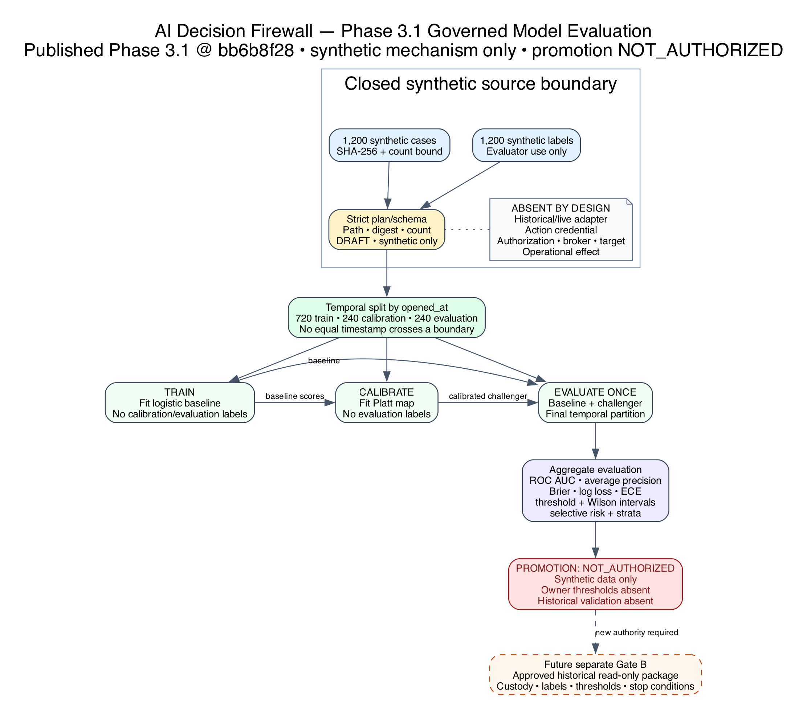

# AI Decision Firewall engineering status and forward plan

## Executive assessment

The program has three distinct current boundaries.

First, Phase 2.5 is published on `main` at exact Commit
`854b15c56397a81de6326b719d3d7d1dc847608f`. GitHub CI and Dependency Graph
checks passed for that exact commit. It retains the local 222/222 Phase 2.5
technical result, separate 9/9 public-site result, and 231/231 then-current
repository aggregate. `P2-CE-005` was not executed or published and remains CE-0
`NOT_EVALUATED`; green package CI is not campaign evidence.

Second, Phase 3 `0.3.0-alpha.1` is published at exact Commit
`423685d105be813056617db738297eba83d3d9d0`; exact-commit CI and Dependency
Graph checks passed. It adds a raw external request, opaque-credential
identity resolution, signed target-bound evidence, trusted policy/target
context, deterministic four-way decision, consequence evaluation, exact-scope
single-use authorization, mandatory in-memory broker, functionally separate
same-project target readback, bounded human approval, lifecycle audit, metrics,
two SOC demonstrations, and a 46-scenario adversarial corpus. The current
published boundary passed 57/57 focused Phase 3 tests; both demo acceptance checks
reported PASS; the corpus reported 46/46; and the full repository regression
passed 288/288 locally and in exact-commit CI.

Third, Phase 3.1 is a published **`0.3.1-alpha.1` synthetic model-evaluation
baseline** at exact Commit `bb6b8f28afba0961bb97b24e6050fccaa94d5702`.
Its Python 3.11/3.12 exact-commit CI and Dependency Graph checks passed. It adds
digest-bound repository fixtures, disjoint temporal
training/calibration/evaluation roles, a logistic baseline, a Platt calibration
challenger, aggregate discrimination/calibration/error/abstention/subgroup
metrics, and an unconditional `NOT_AUTHORIZED` promotion state. It contains no
historical/live adapter or action path and has no owner-approved performance
threshold or model-promotion authority.

Fourth, the provisional, unreleased **`0.4.0-alpha.2` Stage A
production-development candidate** adds an opt-in single-host control ledger
after exact-baseline
testing found that a completed request could cause a second synthetic effect
after restart. ADR-015 extends that local mechanism with a separately pathed
SQLite synthetic-adapter state/receipt store and a closed, sanitized terminal
request-result lookup. Authority reservation, adapter state/receipt, terminal
result, and JSONL audit are distinct commit boundaries without cross-store
atomicity. Bounded cooperative same-host fencing, strict store/cross-store
correlation, valid normal-audit closure before T3, and an exact three-record
recovery-audit protocol are implemented. The adapter receipt and same-project
observer are not independent target evidence. The 18-domain production gate
remains `BLOCKED`; this is not a deployed service, distributed replay control,
process isolation, HA, or operational authority.

At the 2026-08-16 source-freeze checkout, 43/43 focused Stage A tests, 18/18
production-readiness-gate tests, the complete 360/360 repository suite, and the
deterministic 46/46 corpus passed locally; the corpus reported
`live_actions_possible=false`. Direct first-creation stress passed 10/10
sequential and 5/5 parallel repetitions, and the integrated exact-once race
passed 5/5 parallel repetitions. These are project-controlled local mechanism
observations. No exact candidate commit, regenerated manifest, CI, release,
owner acceptance, independent verification, or operational-effectiveness claim
is attached to them.

All Phase 3 observations are CE-1 implementation-conformance evidence over
synthetic inputs and effects. They do not establish live containment,
operational efficacy or calibration, production safety, statistical risk, or
external independence.

## Decision table

| State | Current truth |
|---|---|
| Published Phase 2.5 code/package | Exact Commit `854b15c56397a81de6326b719d3d7d1dc847608f` on `main`; exact-commit CI and Dependency Graph green |
| Published Phase 2 evidence | `P2-CE-001` through `P2-CE-004`, version bound to their records and limitations |
| Phase 2.5 campaign evidence | `P2-CE-005` CE-0 `NOT_EVALUATED`; no execution, result ledger, pass rate, CE-2 record, or evidence-only Commit B |
| Phase 3 implementation | Published at exact Commit `423685d`; raw request through optional synthetic effect and separate readback implemented |
| Phase 3 T&E | Required high-risk/no-effect and low-risk/verified-effect demo acceptance PASS; deterministic corpus 46/46; focused tests 57/57; exact-commit CI passed |
| Phase 3 repository aggregate | Then-current 288/288 passed locally and in exact-commit CI |
| Phase 3.1 model evaluation | Published exact Commit `bb6b8f28`; 11/11 focused and 299/299 then-current aggregate; exact-commit CI/Dependency Graph passed; no historical data or promotion authority |
| Stage A durability increment | Provisional unreleased `0.4.0-alpha.2`; separate single-host SQLite control and offline synthetic-adapter stores plus JSONL audit and sanitized lookup; local source freeze 43/43 focused, 18/18 readiness gate, 360/360 full, 46/46 corpus; no exact candidate commit/manifest/CI, cross-store atomicity, or production authorization; gate `BLOCKED` |
| Data/action boundary | Synthetic only; no historical organizational data, live feed, test tenant, production connector, credential, or live action |

## What Phase 3 adds


### Request and trust plane

- Closed v0.3.0 raw-request and policy schemas with strict duplicate/non-finite,
  size/depth, version, field, and timestamp handling.
- Opaque invocation credential resolution to a signed `ResolvedPrincipal`, plus
  trusted policy registries for agent authority, source properties, action
  constraints, target criticality/dependencies/consequences, and
  firewall-owned time.
- Runtime HMAC evidence attestation over source, provenance, observation time,
  content, semantic support/contradiction, relevance, and subject target.
- Freshness-at-decision, reliability, relevance, corroboration, conflict,
  missing-source, content-integrity, and poisoned-text assessment.

### Decision and consequence plane

- Exact `ALLOW`, `DENY`, `ESCALATE`, and `ALLOW_CONSTRAINED` outcomes.
- Structured stable reason codes, applicable rules, evidence/authority/
  consequence findings, constraints, policy digest, and decision-context digest.
- Explicit consequence evaluation for reversibility, criticality, dependencies,
  cascade, blast radius, downtime, mission, safety, availability, and required
  human authority.
- Recommendation/confidence separation: agent output remains advisory and never
  grants authority.
- Functionally separate deterministic decision verification before token issue.
- Code-owned policy safety invariants for unique closed rule precedence,
  evidence trust/strength/corroboration/zero-conflict floors, severe-consequence
  approval floors, and Tier-0 treatment for every domain controller.

### Authorization, execution, and verification plane

- HMAC authorization binding issuer instance, request, decision, agent, action,
  target, canonical permitted parameters, issue/expiry time, policy identity and
  digest, decision context, target precondition, nonce, and signature.
- Atomic process-local single-use consumption, including failed attempts;
  sequential, concurrent, prior-instance, expired, altered, and wrong-scope
  reuse is rejected.
- Mandatory broker and in-memory target mutation guarded by a private execution
  capability and a target-state precondition.
- Separate read-only target observation; broker-reported success cannot produce
  `VERIFIED`. Final classes include `FAILED`, `PARTIAL`, `UNEXPECTED_EFFECT`,
  and `ROLLBACK_REQUIRED`.
- Signed registered expiring human-approval requirement. A separately resolved
  opaque human credential can create one atomically recorded exact-scope signed
  reevaluation receipt; the approval gate cannot mint a token, cause
  reevaluation, or invoke the broker.

### Audit and observability

- Correlated hash-linked request lifecycle through validation/decision,
  authorization or suppression, broker/attempt, verification, and final state.
- Explicit nonexecuting and broker-rejected terminal paths without fabricated
  downstream events.
- Exact executed-path request/decision/token/attempt/target/state/effect/
  verification correlation. A post-effect prewrite audit failure closes through
  one honest `POST_EFFECT_ACCOUNTING_FAILURE`, returns `ROLLBACK_REQUIRED`, and
  reconciles the decision/verification-failure counters exactly once; it does
  not automate rollback.
- Decision/rule/conflict/authorization/broker/verification/latency metrics.
- Demo and corpus outputs omit reusable token signatures and runtime keys and
  refuse to overwrite nonempty destinations.

## Demonstrated mission paths

| Demonstration | Trusted conditions | Observed local result |
|---|---|---|
| Tier-0 domain controller | AI requests isolation at confidence `0.96`; stale and conflicting evidence; authentication-service dependency and cascading consequence; agent lacks Tier-0 authority | `ESCALATE`; bound human-review requirement; no authorization, broker call, or state change |
| Low-criticality workstation | Credential-resolved workstation-containment authority; fresh corroborated HMAC-attested evidence; reversible bounded action | `ALLOW`; one exact-scope authorization and synthetic broker attempt; functionally separate same-project observation `VERIFIED` |

The deterministic corpus adds 46 declared canonical, evidence, authority,
consequence, token/replay/bypass, broker/verifier, metamorphic, and combined
attack cases. All 46 matched their project-controlled expectations locally.
This is complete coverage of the declared corpus, not exhaustive security
coverage or a statistical failure estimate.

## Safety defects found and closed

Adversarial review found and closed release-blocking defects across cascading
consequence and signed subject-target evidence binding; opaque credential and
trust-domain key handling; polymorphic/late-mutable security values; machine
policy safety floors; request/token/verifier/approval replay and failure
atomicity; injected clock, identifier, verifier, broker, observer, and audit
dependency failures; and executed-path/post-effect audit correlation. The
57-test focused suite includes dedicated negative regressions for these classes.
These corrections are meaningful CE-1 implementation evidence, not exhaustive
security assurance.

## Security and evidence boundaries

- The broker capability, private target method, and exact environment type are
  application-level Python controls. They are not OS/process isolation, a
  reference monitor, or protection against arbitrary hostile same-process code.
- In the published Phase 3 baseline, request and authorization ledgers are
  process-local memory. The opt-in Stage A candidate replaces that narrow path
  with local durable authority state and a separate durable synthetic-adapter
  database plus bounded cooperative same-host fencing, but remains
  non-distributed and without a cross-store transaction, distributed execution-
  ownership fence, or multi-node replay guarantee.
- Evidence attestations use domain-separated runtime HMAC synthetic keys. They do not establish
  enterprise device identity, PKI/HSM custody, source authenticity,
  nonrepudiation, rotation/revocation, or independent provenance.
- Decision and target verifiers are functionally separate non-model components
  in the same project/process. They are not an external oracle or
  organizationally independent assurance.
- Human approval authorizes a reevaluation receipt for an exact scope only. It
  is not an action token, cannot execute, and does not itself cause
  reevaluation.
- Audit is self-custodied and hash linked, not externally anchored, WORM
  protected, trusted-time bound, or resistant to complete authorized
  replacement/truncation.
- Two synthetic targets and injected faults do not establish vendor semantics,
  real topology, eventual consistency, rollback feasibility, human workflow,
  mission outcome, or operational safety.

## Stage A offline durability boundary

ADR-015 defines three store-local transactions: consume authority and reserve
an attempt in the control database; apply the exact-bound command and insert an
immutable receipt in the separate offline synthetic-adapter database; then,
after same-project read-only observation and successful readback of a valid
normal JSONL lifecycle closure, close the attempt/request and store a sanitized
terminal `RequestLookupResult` in the control database. The control database,
adapter database, and JSONL lifecycle audit are three authoritative artifacts;
the audit remains separate from all three database transactions.

All three artifact paths are safely preflighted before a missing artifact is
created. Existing stores are opened query-only for strict version, schema,
semantic, path/link/type/mode, and sidecar checks. Startup and durable process,
lookup, approval, and recovery routes use bounded cooperative same-host
fencing. Cross-store validation correlates overlapping principal, request,
decision/context, authority, policy, receipt, and terminal target facts and
fails closed on a missing required or orphan receipt or a recomputed
substitution.

An authenticated exact-principal, exact-request, exact-digest lookup can return
only the persisted authority-free terminal projection. It explicitly reports
that the lookup created no decision, authorization, execution attempt, or
effect. It never returns the original signed token or smuggles the projection
through the existing `Phase3Result` processing contract. Changed request or
adapter bindings fail closed without disclosing the prior result.

Recovery remains explicit and quiesced. An exact affirmative `NO_EFFECT`
receipt can support `FAILED_NO_EFFECT`; an applied, partial, ambiguous, or
absent receipt without separately durable verification closes conservatively as
`UNKNOWN_EFFECT` with `recovery_required=true`; absence is not no-effect
evidence or retry authority. Corrupt, unavailable, or mismatched
adapter evidence halts reconciliation without changing state. Before T3,
recovery writes and reads back an exact contiguous `RECOVERY_STARTED`,
`RECOVERY_EVIDENCE_ASSESSED`, `RECOVERY_FINALIZED` trio that records the
correlated original lifecycle as `COMPLETE`, `INCOMPLETE`, or `UNRESOLVED`.
Append/readback failure suppresses T3; partial prefixes resume idempotently;
pending recovery fences other durable writers; and a post-T3 repeat is an
audit-inert replay. The quiescence assertion and same-host cooperative fence do
not constitute a distributed lease, epoch, or execution-ownership guarantee.

<!-- PAGE BREAK -->

## Reproduce the published Phase 3 observations

```bash
PYTHONDONTWRITEBYTECODE=1 PYTHONPATH=src python3 -m unittest \
  tests.test_phase3_contracts \
  tests.test_phase3_decision_path \
  tests.test_phase3_authorization_boundary \
  tests.test_phase3_adversarial \
  tests.test_phase3_end_to_end \
  tests.test_phase3_corpus \
  tests.test_phase3_release_blockers -v

demo_dir="$(mktemp -d /tmp/adf-phase3-demo.XXXXXX)"
PYTHONDONTWRITEBYTECODE=1 PYTHONPATH=src python3 run_phase3.py \
  --output-dir "$demo_dir"

corpus_dir="$(mktemp -d /tmp/adf-phase3-corpus.XXXXXX)"
PYTHONDONTWRITEBYTECODE=1 PYTHONPATH=src python3 run_phase3_corpus.py \
  --output-dir "$corpus_dir"
```

Reproduce the current repository aggregate:

```bash
PYTHONDONTWRITEBYTECODE=1 PYTHONPATH=src python3 -m unittest discover -s tests -v
```

Successful local return is diagnostic evidence for the checkout that ran. The
published Phase 3 result remains version-bound to exact Commit `423685d`; a
later result requires its own exact commit, CI and manifest verification.

## Phase 3.1 model-evaluation boundary



The working Phase 3.1 package trains only on the earliest temporal partition,
fits the calibration challenger only on the middle partition, and evaluates
both candidates once on the final partition. The same project-controlled
evaluator holds all synthetic labels; this is logical role separation, not
independent custody. Current results are mechanism observations only and cannot
support superiority, promotion, operational calibration, or historical-data
claims.

## Forward plan and gates

1. **Package the locally frozen ADR-015 increment separately.** Preserve the
   exact two-database synthetic mechanism, tests, traceability, and diagrams;
   regenerate and verify the integrity manifest; then record an exact candidate
   commit and CI without changing the published Phase 3 or Phase 3.1 evidence
   boundaries.
2. **Expand the local failure campaign.** Build on the selected process-kill,
   response-loss, audit-failure, cross-store corruption, and concurrent-startup
   cases with power-loss, filesystem/disk exhaustion, backup/restore,
   retention/compaction, and bounded-load evidence at every authority, adapter,
   observation, audit, and result boundary.
3. **Keep promotion prohibited.** Require owner-approved metrics, thresholds,
   uncertainty rules, subgroup floors and rollback criteria before any model
   replacement can be proposed.
4. **Keep data-bearing work separate.** `P2-CE-005`, if pursued, retains its
   two-commit protocol. Historical replay requires an authenticated restricted
   Gate B package. Neither is implied by Phase 3 simulation success.
5. **Require a new architecture before integration.** A read-only service or
   controlled non-production action phase requires enterprise identity and
   source trust, process isolation and authenticated IPC, managed keys, tested
   execution ownership/fencing, durable distributed idempotency, vendor-specific
   broker and independently custodied readback, rollback/reconciliation,
   external audit custody, change/incident authority, and authorizing-official
   acceptance.

See the [Phase 3 index](phase3/README.md), [architecture](phase3/ARCHITECTURE.md),
[security and safety case](phase3/SECURITY_AND_SAFETY_CASE.md), [T&E plan](phase3/TEST_AND_EVALUATION_PLAN.md),
and [requirements traceability](phase3/REQUIREMENTS_TRACEABILITY.csv).
