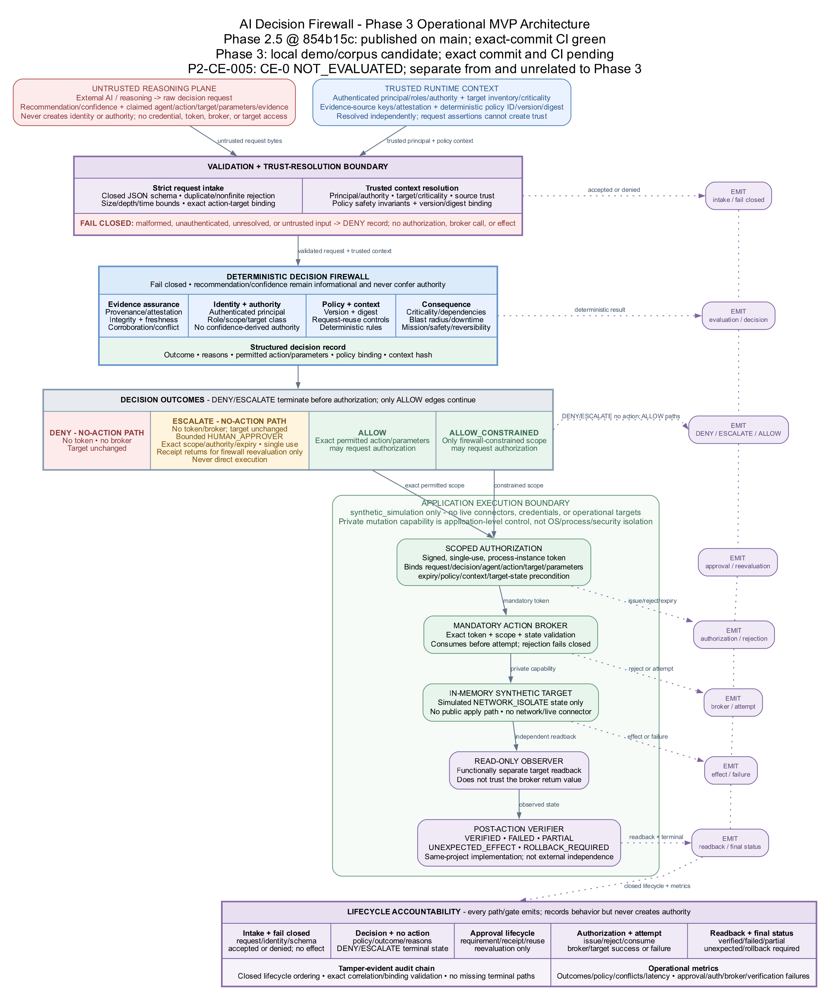

# AI Decision Firewall engineering status and forward plan

## Executive assessment

The program has two distinct current boundaries.

First, Phase 2.5 is published on `main` at exact Commit
`854b15c56397a81de6326b719d3d7d1dc847608f`. GitHub CI and Dependency Graph
checks passed for that exact commit. It retains the local 222/222 Phase 2.5
technical result, separate 9/9 public-site result, and 231/231 then-current
repository aggregate. `P2-CE-005` was not executed or published and remains CE-0
`NOT_EVALUATED`; green package CI is not campaign evidence.

Second, Phase 3 is a working **local `0.3.0-alpha.1` simulation-only
operational-MVP candidate**. It adds a raw external request, opaque-credential
identity resolution, signed target-bound evidence, trusted policy/target
context, deterministic four-way decision, consequence evaluation, exact-scope
single-use authorization, mandatory in-memory broker, functionally separate
same-project target readback, bounded human approval, lifecycle audit, metrics,
two SOC demonstrations, and a 46-scenario adversarial corpus. The current
checkout passed 57/57 focused Phase 3 tests; both demo acceptance checks
reported PASS; the corpus reported 46/46; and the full repository regression
passed 288/288. No Phase 3 commit, publication, or exact-commit CI result exists
yet.

All Phase 3 observations are CE-1 implementation-conformance evidence over
synthetic inputs and effects. They do not establish live containment,
operational efficacy or calibration, production safety, statistical risk, or
external independence.

<!-- PAGE BREAK -->

## Decision table

| State | Current truth |
|---|---|
| Published Phase 2.5 code/package | Exact Commit `854b15c56397a81de6326b719d3d7d1dc847608f` on `main`; exact-commit CI and Dependency Graph green |
| Published Phase 2 evidence | `P2-CE-001` through `P2-CE-004`, version bound to their records and limitations |
| Phase 2.5 campaign evidence | `P2-CE-005` CE-0 `NOT_EVALUATED`; no execution, result ledger, pass rate, CE-2 record, or evidence-only Commit B |
| Phase 3 implementation | Working local candidate; raw request through optional synthetic effect and separate readback implemented |
| Phase 3 local T&E | Required high-risk/no-effect and low-risk/verified-effect demo acceptance PASS; deterministic corpus 46/46; focused tests 57/57 |
| Phase 3 repository aggregate | 288/288 passed in the settled local checkout; exact-commit CI pending |
| Phase 3 external gates | Final exact commit, explicit publication authorization, GitHub CI and Dependency Graph |
| Data/action boundary | Synthetic only; no historical organizational data, live feed, test tenant, production connector, credential, or live action |

## What Phase 3 adds



### Request and trust plane

- Closed v0.3.0 raw-request and policy schemas with strict duplicate/non-finite,
  size/depth, version, field, and timestamp handling.
- Opaque invocation credential resolution to a signed `ResolvedPrincipal`, plus
  trusted policy registries for agent authority, source properties, action
  constraints, target criticality/dependencies/consequences, and
  firewall-owned time.
- Runtime HMAC evidence attestation over source, provenance, observation time,
  content, semantic support/contradiction, relevance, and subject target.
- Freshness-at-decision, reliability, relevance, corroboration, conflict,
  missing-source, content-integrity, and poisoned-text assessment.

### Decision and consequence plane

- Exact `ALLOW`, `DENY`, `ESCALATE`, and `ALLOW_CONSTRAINED` outcomes.
- Structured stable reason codes, applicable rules, evidence/authority/
  consequence findings, constraints, policy digest, and decision-context digest.
- Explicit consequence evaluation for reversibility, criticality, dependencies,
  cascade, blast radius, downtime, mission, safety, availability, and required
  human authority.
- Recommendation/confidence separation: agent output remains advisory and never
  grants authority.
- Functionally separate deterministic decision verification before token issue.
- Code-owned policy safety invariants for unique closed rule precedence,
  evidence trust/strength/corroboration/zero-conflict floors, severe-consequence
  approval floors, and Tier-0 treatment for every domain controller.

### Authorization, execution, and verification plane

- HMAC authorization binding issuer instance, request, decision, agent, action,
  target, canonical permitted parameters, issue/expiry time, policy identity and
  digest, decision context, target precondition, nonce, and signature.
- Atomic process-local single-use consumption, including failed attempts;
  sequential, concurrent, prior-instance, expired, altered, and wrong-scope
  reuse is rejected.
- Mandatory broker and in-memory target mutation guarded by a private execution
  capability and a target-state precondition.
- Separate read-only target observation; broker-reported success cannot produce
  `VERIFIED`. Final classes include `FAILED`, `PARTIAL`, `UNEXPECTED_EFFECT`,
  and `ROLLBACK_REQUIRED`.
- Signed registered expiring human-approval requirement. A separately resolved
  opaque human credential can create one atomically recorded exact-scope signed
  reevaluation receipt; the approval gate cannot mint a token, cause
  reevaluation, or invoke the broker.

### Audit and observability

- Correlated hash-linked request lifecycle through validation/decision,
  authorization or suppression, broker/attempt, verification, and final state.
- Explicit nonexecuting and broker-rejected terminal paths without fabricated
  downstream events.
- Exact executed-path request/decision/token/attempt/target/state/effect/
  verification correlation. A post-effect prewrite audit failure closes through
  one honest `POST_EFFECT_ACCOUNTING_FAILURE`, returns `ROLLBACK_REQUIRED`, and
  reconciles the decision/verification-failure counters exactly once; it does
  not automate rollback.
- Decision/rule/conflict/authorization/broker/verification/latency metrics.
- Demo and corpus outputs omit reusable token signatures and runtime keys and
  refuse to overwrite nonempty destinations.

## Demonstrated mission paths

| Demonstration | Trusted conditions | Observed local result |
|---|---|---|
| Tier-0 domain controller | AI requests isolation at confidence `0.96`; stale and conflicting evidence; authentication-service dependency and cascading consequence; agent lacks Tier-0 authority | `ESCALATE`; bound human-review requirement; no authorization, broker call, or state change |
| Low-criticality workstation | Credential-resolved workstation-containment authority; fresh corroborated HMAC-attested evidence; reversible bounded action | `ALLOW`; one exact-scope authorization and synthetic broker attempt; functionally separate same-project observation `VERIFIED` |

The deterministic corpus adds 46 declared canonical, evidence, authority,
consequence, token/replay/bypass, broker/verifier, metamorphic, and combined
attack cases. All 46 matched their project-controlled expectations locally.
This is complete coverage of the declared corpus, not exhaustive security
coverage or a statistical failure estimate.

## Safety defects found and closed

Adversarial review found and closed release-blocking defects across cascading
consequence and signed subject-target evidence binding; opaque credential and
trust-domain key handling; polymorphic/late-mutable security values; machine
policy safety floors; request/token/verifier/approval replay and failure
atomicity; injected clock, identifier, verifier, broker, observer, and audit
dependency failures; and executed-path/post-effect audit correlation. The
57-test focused suite includes dedicated negative regressions for these classes.
These corrections are meaningful CE-1 implementation evidence, not exhaustive
security assurance.

## Security and evidence boundaries

- The broker capability, private target method, and exact environment type are
  application-level Python controls. They are not OS/process isolation, a
  reference monitor, or protection against arbitrary hostile same-process code.
- Request and authorization ledgers are process-local memory. They are not
  durable, distributed, crash consistent, or sufficient for multi-node replay
  prevention/idempotency.
- Evidence attestations use domain-separated runtime HMAC synthetic keys. They do not establish
  enterprise device identity, PKI/HSM custody, source authenticity,
  nonrepudiation, rotation/revocation, or independent provenance.
- Decision and target verifiers are functionally separate non-model components
  in the same project/process. They are not an external oracle or
  organizationally independent assurance.
- Human approval authorizes a reevaluation receipt for an exact scope only. It
  is not an action token, cannot execute, and does not itself cause
  reevaluation.
- Audit is self-custodied and hash linked, not externally anchored, WORM
  protected, trusted-time bound, or resistant to complete authorized
  replacement/truncation.
- Two synthetic targets and injected faults do not establish vendor semantics,
  real topology, eventual consistency, rollback feasibility, human workflow,
  mission outcome, or operational safety.

<!-- PAGE BREAK -->

## Reproduce the local Phase 3 observations

```bash
PYTHONDONTWRITEBYTECODE=1 PYTHONPATH=src python3 -m unittest \
  tests.test_phase3_contracts \
  tests.test_phase3_decision_path \
  tests.test_phase3_authorization_boundary \
  tests.test_phase3_adversarial \
  tests.test_phase3_end_to_end \
  tests.test_phase3_corpus \
  tests.test_phase3_release_blockers -v

demo_dir="$(mktemp -d /tmp/adf-phase3-demo.XXXXXX)"
PYTHONDONTWRITEBYTECODE=1 PYTHONPATH=src python3 run_phase3.py \
  --output-dir "$demo_dir"

corpus_dir="$(mktemp -d /tmp/adf-phase3-corpus.XXXXXX)"
PYTHONDONTWRITEBYTECODE=1 PYTHONPATH=src python3 run_phase3_corpus.py \
  --output-dir "$corpus_dir"
```

Reproduce the settled local repository aggregate:

```bash
PYTHONDONTWRITEBYTECODE=1 PYTHONPATH=src python3 -m unittest discover -s tests -v
```

Successful local return is diagnostic evidence for the checkout that ran. It
does not substitute for an exact commit, CI, manifest verification, or external
review.

## Forward plan and gates

1. **Close the local candidate.** Reconcile traceability and diagrams and
   resolve every release-blocking finding.
2. **Freeze and verify.** Run the focused Phase 3 modules, final repository
   aggregate, both demos, corpus, documentation/link/schema/CSV checks, and
   integrity/package checks against settled bytes.
3. **Commit and publish deliberately.** Create one exact Phase 3 commit, record
   its results, publish only under explicit authorization, and require green
   exact-commit GitHub CI and Dependency Graph checks.
4. **Keep data-bearing work separate.** `P2-CE-005`, if pursued, retains its
   two-commit protocol. Historical replay requires an authenticated restricted
   Gate B package. Neither is implied by Phase 3 simulation success.
5. **Require a new architecture before integration.** A read-only service or
   controlled non-production action phase requires enterprise identity and
   source trust, process isolation, managed keys, durable distributed
   idempotency, vendor-specific broker/readback, rollback/reconciliation,
   external audit custody, change/incident authority, and authorizing-official
   acceptance.

See the [Phase 3 index](phase3/README.md), [architecture](phase3/ARCHITECTURE.md),
[security and safety case](phase3/SECURITY_AND_SAFETY_CASE.md), [T&E plan](phase3/TEST_AND_EVALUATION_PLAN.md),
and [requirements traceability](phase3/REQUIREMENTS_TRACEABILITY.csv).
