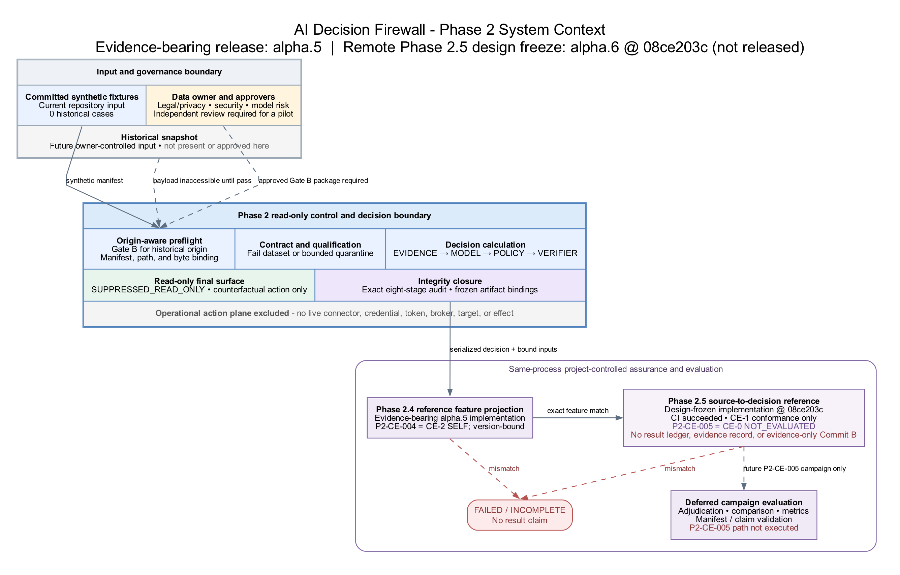
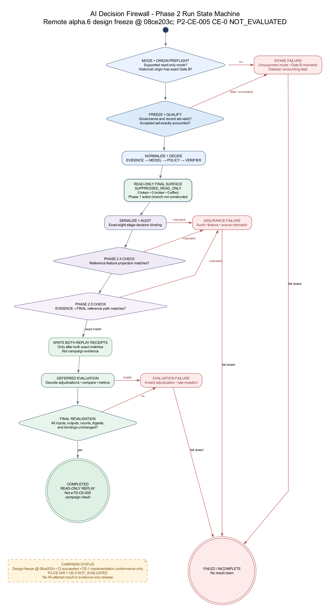
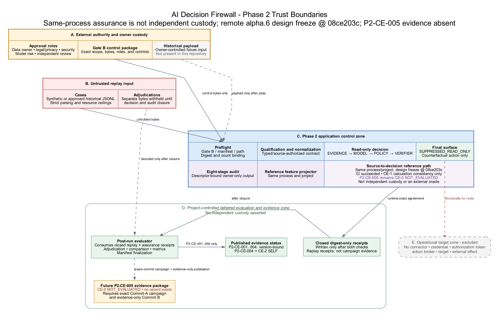

# AI Decision Firewall Engineering Status and Forward Plan

## Executive assessment

The repository is aligned to the actual program boundary as of 2026-08-15. The latest evidence-bearing baseline remains `0.2.0-alpha.5` at commit `f7f6b5c` (Phase 2.4). Exact commit `08ce203c0965e8d43b7653454d4ea8315996021f` is the predecessor `0.2.0-alpha.6` Phase 2.5 design-freeze baseline; its historical GitHub CI and Dependency Graph workflows completed successfully. This package candidate is rebased onto the already-published public-site baseline at `github/main@c3400e0` and adds bounded local-write interlocks, campaign constructor instrumentation, selected Gate B causal-identity/oracle and payload-observer scaffolding, documentation, visuals, and this status package. Its source reconciliation is complete, its tracked data, campaign-bound model, and `outputs/baseline/**` remain at their committed bytes, and its Phase 2.5 technical suite passed 222/222. The separate public-site module passed 9/9, producing a combined repository aggregate of 231/231; the site and its tests are not Phase 2.5 or `P2-CE-005` evidence. The campaign module passed 21/21, the chart check passed in the frozen renderer, and the candidate includes a generated-and-verified integrity manifest plus paired final-source DOCX/PDF renders whose 15 pages were inspected without blank, clipped, or run-in-heading defects. It is not a tag, release, or evidence package. Package commit and publication, followed by GitHub CI on the exact published package commit, remain external release gates. Phase 2.5 does not add historical data, a live feed, an operational connector, action authority, or an observed campaign result.

The predecessor design-freeze implementation passed 193/193 tests in a fresh isolated review run and passed commit-bound repository CI. This package candidate subsequently passed 222/222 Phase 2.5 technical tests in a local isolated run; the separate public-site module passed 9/9, and the combined repository aggregate passed 231/231. Only the 222-test technical scope supports the narrow CE-1 implementation-conformance statements below. Neither the site module nor the repository aggregate creates `P2-CE-005` evidence.

> **Release hold:** Do not describe alpha.6 as a tagged release or released evidence package, and do not describe `P2-CE-005` as evaluated. The local manifest, rendering, visual, and test gates are complete. Before release, publish the exact package commit and require GitHub CI to pass on that published commit. Execute the `P2-CE-005` campaign only under its separate two-commit evidence protocol.

| State | Current truth |
|---|---|
| Latest evidence-bearing baseline | `0.2.0-alpha.5`, commit `f7f6b5c`, Phase 2.4 |
| Predecessor design-freeze baseline | `0.2.0-alpha.6`, commit `08ce203c`; historical 193/193 local run, GitHub CI, and Dependency Graph succeeded for that exact commit |
| This package candidate | Bounded campaign and `run_poc` path controls; campaign constructor instrumentation; selected Gate B failure/oracle/observer scaffolding; documentation, diagrams, charts, and this status package; source reconciliation complete and Phase 2.5 technical suite passed 222/222 |
| Separate published-site scope | Rebased onto `github/main@c3400e0`; public-site module passed 9/9 and remains outside Phase 2.5 and `P2-CE-005` evidence |
| Combined repository aggregate | 231/231 passed locally: 222 Phase 2.5 technical tests plus 9 separate public-site tests |
| Completed local package gates | 222/222 Phase 2.5 technical suite; 9/9 separate public-site module; 231/231 repository aggregate; 21/21 campaign module; frozen-renderer chart check; generated-and-verified integrity manifest; paired final-source DOCX/PDF; all 15 rendered pages inspected with no blank, clipped, or run-in-heading defects |
| Remaining external gates | Package commit and publication; GitHub CI on the exact published package commit |
| Published Phase 2 evidence | `P2-CE-001` through `P2-CE-004`, each version-bound to its recorded artifacts and limitations |
| Planned Phase 2.5 evidence | `P2-CE-005`, CE-0 `NOT_EVALUATED`; no result ledger, evidence record, pass rate, or CE-2 claim |
| Data maturity | Synthetic fixtures only; zero historical cases |
| Operational maturity | Offline and read-only in Phase 2; no connector, credential, token, broker, target, or effect path |

## What changed in this review

- Separated the published alpha.5 evidence baseline from the alpha.6 release candidate across the README, changelog, roadmap, Phase 2 index, engineering plans, cards, safety case, traceability records, and Gate B material.
- Replaced the four v0.1-centric architecture diagrams with Phase 2 system-context, logical-architecture, run-state, and trust-boundary views.
- Preserved the three Phase 1 metric charts as historical v0.1 synthetic-simulation results, added explicit provenance and nonclaim labels, and added deterministic PNG/SVG regeneration with a check mode.
- Preserved the 32-page v0.1 DOCX/PDF as immutable historical artifacts. They are not the current Phase 2 package and are not overwritten by this document.
- Added ADR 007 for the accepted Phase 2.4 reference feature projector and ADR 008 for the accepted Phase 2.5 source-to-decision design candidate.
- Corrected source-to-decision arithmetic and campaign accounting defects found during review and added negative and boundary regression coverage.
- Added a bounded `run_poc` write interlock. Ordinary repository writes are limited to `data/local/**` and `outputs/local/**`; the explicit freeze flag expands that allowance only to `data/**` and `outputs/baseline/**`. Preflight covers every generated leaf, including `run_manifest.json`, rejects redirects, case-variant repository aliases, and unsafe existing leaves, and the local manifest binds its seven other outputs. Fourteen focused tests pass. This is not an OS sandbox, mount boundary, TOCTOU/race guarantee, comprehensive hardlink defense, or confinement of direct writer APIs.
- Added CE-1-only Gate B scaffolding: a closed registry of 25 selected causal identities, exact-match oracle tuples for 24 selected pre-payload mutations plus one post-qualification threshold identity, and a bounded observer that recorded zero `cases` or `adjudications` role access under its enumerated Python APIs for the 24 selected pre-payload mutations. Unclassified Gate B failures remain unscorable; this is not a complete taxonomy, OS-level nonaccess proof, reference monitor, or campaign result.
- Kept the full research-screen date at 2026-08-14 because the 2026-08-15 activity was a targeted source check, not a complete rescreen. A full Phase 2.5 claim-class refresh remains pending.

## Current system context

The current architecture is a governed, offline, read-only decision and assurance path. Under the enumerated application controls, the historical-origin path is designed to stop before governed payload access when structural Gate B preflight fails. Accepted cases proceed through deterministic evidence, model, policy, verifier, and read-only final surfaces. The action plane is structurally absent in Phase 2. This is an application-level control statement, not proof of OS-level nonaccess or non-egress.

<!-- PAGE BREAK -->

## Logical architecture

Phase 2 puts governance, custody, qualification, decision calculation, integrity checking, and deferred evaluation into separate control stages. The Phase 1 authorization and in-memory simulator path remains available only under `synthetic_simulation` compatibility testing.

<!-- PAGE BREAK -->

## Assurance and completion semantics

- The harness first validates the serialized decision and its exact eight-stage audit trace.
- Phase 2.4 separately reconstructs the 20 modeled feature values and event trace.
- Phase 2.5 then separately reconstructs `EVIDENCE`, `MODEL`, `POLICY`, `VERIFIER`, and `FINAL_SURFACE` from frozen normalized-case, model, policy, and decision bytes.
- A source-to-decision mismatch publishes neither reference receipt and stops before evaluator decoding, comparison, metrics, and completed-run finalization.
- A successful run writes and binds both metadata-only assurance receipts, revalidates deterministic and volatile artifacts, and returns successfully only after final manifest checks.
- The two reference implementations are separate in code but remain same-process, same-project, and project-controlled. Agreement is calculation consistency, not external independence, source truth, policy fitness, efficacy, or custody.

<!-- PAGE BREAK -->

## Evidence state

| Record | Evidence class | Observed state | Permitted statement |
|---|---|---|---|
| `P2-CE-001` | CE-2 SELF | Published, three-case synthetic starter | Version-bound replay behavior only |
| `P2-CE-002` | CE-2 SELF | Published, seven-record synthetic qualification result | Exact 3 accepted plus 4 quarantined accounting only |
| `P2-CE-003` | CE-2 SELF | Published, 32/32 fixed Gate B outcomes | Exact project-controlled preflight behavior only |
| `P2-CE-004` | CE-2 SELF | Published, 32/32 fixed feature-assurance outcomes | Exact project-controlled feature-assurance behavior only |
| `P2-CE-005` | CE-0 | Plan and implementation scaffolding only | `NOT_EVALUATED`; no result, rate, or CE-2 language |

None of the evidence above establishes historical or live performance, statistical representativeness, organizational approval, independent replication, OS-level isolation, target-side outcomes, production readiness, efficacy, or an operational failure bound.

<!-- PAGE BREAK -->

## Review verification

| Check | Outcome |
|---|---|
| Phase 2.5 technical suite | This package candidate passed 222/222 locally; this is the technical evidence scope and a prepublication observation, not a GitHub CI result |
| Separate public-site module | 9/9 passed locally; site behavior is outside Phase 2.5 and `P2-CE-005` evidence |
| Combined repository aggregate | 231/231 passed locally after the package candidate was rebased onto `github/main@c3400e0` |
| Predecessor design freeze | Commit `08ce203c` retains its version-bound historical 193/193 local result and successful GitHub CI and Dependency Graph results |
| Campaign CLI and reference-attempt instrumentation | 3/3 CLI checks, one check-leaf safety regression, one constructor-sensitivity regression, and 21/21 campaign-module tests passed in an isolated clean clone; bounded operator-error and Python-construction controls only |
| `run_poc` local-write guard | 14 focused checks passed; ordinary and explicit-freeze destinations, case-variant repository aliases, every generated leaf, and seven-output local-manifest binding covered within the documented application-level limits |
| Gate B causal/oracle/observer scaffolding | 25 selected identities registered; 24 selected pre-payload mutations exercised with zero observed governed payload roles under the enumerated Python APIs, plus one post-qualification threshold identity; CE-1 scaffolding only |
| Source-to-decision campaign | Test-level in-memory and temporary-artifact paths were exercised; no eligible clean exact-Commit-A evidence execution or publication occurred |
| Published claim-evidence records | Revalidated under their exact version-bound profiles |
| Architecture visuals | DOT sources regenerated to PNG and SVG and visually reviewed |
| Phase 1 metric visuals | Source totals verified; chart check passed in the frozen renderer |
| Document structure | Relative links, Markdown fences, CSV widths, and whitespace checked |
| Repository integrity manifest | Generated and verified for this package candidate |
| Generated status package | Paired DOCX/PDF rebuilt from the final source with the final builder; all 15 rendered pages inspected with no blank, clipped, or run-in-heading defects |

The predecessor 193-test and commit-bound workflow records remain bound to exact design-freeze Commit `08ce203c`. The 222/222 result covers this package candidate's Phase 2.5 technical scope in a local isolated run, including five campaign-delta tests, 14 `run_poc` tests, six Gate B oracle tests, and four payload-observer tests. The separately inherited public-site module passed 9/9, bringing the local repository aggregate to 231/231 without changing the Phase 2.5 evidence boundary. The generated-and-verified integrity manifest, frozen-renderer chart check, paired final-source DOCX/PDF rebuild, and 15-page inspection complete the local package gates.

<!-- PAGE BREAK -->

## Run state machine

The run is complete only after read-only suppression, exact audit validation, both reference checks, deferred evaluation, output revalidation, and successful harness return. Any failed gate terminates the run; intermediate file presence is diagnostic, not evidence of completion.

<!-- PAGE BREAK -->

## Trust and custody boundaries

The implementation provides application-level controls around authority, frozen control bytes, untrusted payloads, owner-only snapshots and outputs, read-only decision calculation, evaluator-only adjudications, and same-process assurance. It does not create independent custody or an OS-enforced sandbox.

<!-- PAGE BREAK -->

## Known limitations and prohibited inferences

- There are zero historical cases, no approved Gate B package, and no authenticated real-world adjudication set in the repository.
- There is no live-feed adapter, test-tenant integration, production connector, credential, action broker, target, or operational effect path in Phase 2.
- The self-custodied SHA-256 audit chain detects presented-record inconsistency but does not resist wholesale replacement by a writer that can recompute the chain.
- Exact agreement between production and reference calculations does not prove that source assertions are authentic, complete, truthful, or semantically correct.
- The `run_poc` destination interlock is an application-level operator-error guard. It does not provide an OS sandbox, mount containment, TOCTOU/race resistance, comprehensive hardlink defense, or confinement of direct writer functions.
- The Gate B observer covers an enumerated set of Python file APIs in the observed process. It does not cover direct system calls, native extensions, subprocesses, pre-opened descriptors, hard-link aliases to governed files, other unenumerated aliases, or same-user access outside that process, and the 25 registered identities are not a complete failure taxonomy.
- Synthetic results are generator-consistent controls, not evidence of field calibration, analyst agreement, false-containment risk, mission suitability, or operational efficacy.
- The research mapping informs threat models and evaluation design. It is not evidence that this implementation inherits another system's safeguards or results.

<!-- PAGE BREAK -->

## Forward plan and release gates

1. **Preserve the completed local package gates.** Source reconciliation, the 222/222 Phase 2.5 technical suite, separate 9/9 public-site module, 231/231 repository aggregate, 21/21 campaign module, frozen-renderer chart check, generated-and-verified manifest, paired final-source DOCX/PDF rebuild, and 15-page inspection are complete. Keep the site tests outside the Phase 2.5 evidence boundary and keep all results bound to this package candidate without promoting them to release or evidence status.
2. **Publish and verify the exact package commit.** Commit and push the complete package, then require GitHub CI and the remaining repository checks to pass on that exact published commit. Tag or release only after every gate passes.
3. **Execute `P2-CE-005` under the evidence protocol.** Use the clean detached final candidate as Commit A, no retries or exclusions, the complete 40-attempt denominator, direct boundary instrumentation, and a fresh frozen evaluator. Publish only an evidence-only Commit B. Invalidate a defective package instead of repairing it in place.
4. **Complete the Phase 2.5 research refresh.** Repeat the documented research-screen procedure before changing the claim class or publishing new evidence.
5. **Prepare Gate B outside the public repository.** Accountable owners must authenticate legal/privacy, mission, security, records, custody, de-identification, mapping, adjudication, sampling, retention, incident, and stop-condition evidence in a restricted system.
6. **Run a small approved offline historical pilot.** Only after Gate B passes, measure complete intake, accepted and quarantined records, mapping loss, source delay, temporal fidelity, analyst disagreement, conditional performance, and survivorship effects.
7. **Defer live shadow and action progression.** A live read-only feed requires a separately approved Phase 3 architecture and safety case. Test-tenant actions and any operational pilot require new authority, integrations, rollback evidence, target-side verification, and action-specific statistical release gates.

<!-- PAGE BREAK -->

## Immediate decision points

| Decision | Recommended position |
|---|---|
| Is alpha.6 ready to be called a release? | No. Local package gates are complete, but package commit and publication and GitHub CI on that exact published commit remain incomplete. |
| Should `P2-CE-005` be run now? | Only after the complete final alpha.6 candidate becomes the clean Commit A and the exact two-commit evidence controls are in place. |
| Should historical data be introduced next? | Only through an authenticated, independently reviewed Gate B package retained outside the public repository. |
| Should live shadow or operational action be enabled? | No. Both require separate architecture, authority, safety, privacy, integration, and validation gates. |
| Where should engineering effort go after `P2-CE-005`? | Independent custody and review, evaluation-environment controls, and a small approved historical pilot - not more same-process agreement alone. |

<!-- PAGE BREAK -->

## Maintained document map

| Artifact family | Current role |
|---|---|
| `README.md`, `CHANGELOG.md`, `docs/ROADMAP.md` | Published-versus-candidate status and forward sequence |
| `docs/phase2/` | Current architecture, contracts, safety, validation, claim evidence, research, qualification, and Gate B controls |
| `docs/adr/` | Architecture decisions, including the accepted Phase 2.4 and Phase 2.5 assurance paths |
| `docs/architecture/` | Current Phase 2 diagrams and historical Phase 1 metric charts with reproducible generators |
| Legacy v0.1 DOCX/PDF package | Immutable historical Phase 1 engineering baseline |
| Current alpha.6 status package | Engineering state, evidence boundary, and forward plan for the release candidate |

## Review conclusion

The repository now tells one consistent story: Phase 1 demonstrated a synthetic action-capable simulator; the latest evidence-bearing Phase 2.4 baseline added structurally read-only replay, qualification, Gate B controls, exact audit checks, and feature assurance; predecessor design-freeze Commit `08ce203c` added source-to-decision calculation assurance; and this package candidate adds bounded application-level path controls and selected Gate B causal-test scaffolding. Source reconciliation and all local package gates are complete. The current technical direction is to publish the exact package commit, require its GitHub CI to pass, publish `P2-CE-005` only through its controlled evidence protocol, and then seek an externally authenticated Gate B package for a small offline historical pilot. No successor campaign has been executed, and nothing in the current tree authorizes historical access, a live feed, or operational action.
