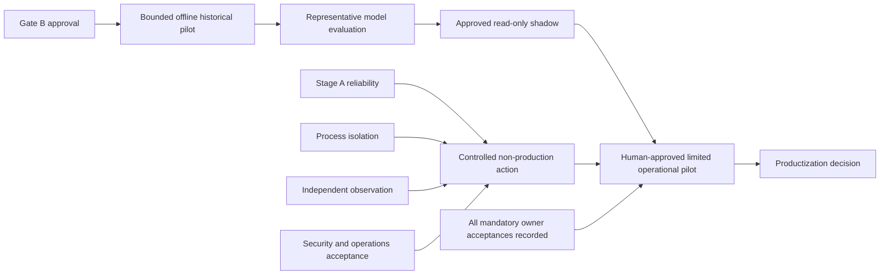

# AI Decision Firewall engineering roadmap

| Roadmap control | State |
|---|---|
| As of | 2026-08-20 |
| Planning horizon | 12–18 months |
| Audited implementation baseline after base-drift recheck | [`83d754846fbd1460e0bb231d1dfab201f4d58c0d`](https://github.com/redxking/ai-decision-firewall/commit/83d754846fbd1460e0bb231d1dfab201f4d58c0d), merged through [PR #35](https://github.com/redxking/ai-decision-firewall/pull/35) |
| Latest tagged developer prerelease | [`v0.4.0-alpha.2`](https://github.com/redxking/ai-decision-firewall/releases/tag/v0.4.0-alpha.2), published from exact commit [`d5c1571930a29d78b31210c219465ecc4d1a793a`](https://github.com/redxking/ai-decision-firewall/commit/d5c1571930a29d78b31210c219465ecc4d1a793a) |
| Authoritative gate state | Production `BLOCKED` under readiness candidate [`8ee9cc8e9ece72056c119cc4dffe5457a57f5994`](https://github.com/redxking/ai-decision-firewall/commit/8ee9cc8e9ece72056c119cc4dffe5457a57f5994); model promotion `NOT_AUTHORIZED`; historical-data, live-integration, external-target, and action authority not granted |

This roadmap is a sequencing and evidence plan. It is not an authorization,
release record, operational commitment, or claim that a planned control is
implemented. Horizons express dependency order and planning confidence; they
are not delivery dates because approved staffing, capacity, intended
environments, and owner availability have not been established.

## Executive decision frame

The project has a released, offline synthetic developer prerelease and a later
merged-but-unreleased engineering baseline. The later baseline adds Stage A
durability and recovery work, storage-fault evidence, supply-chain controls,
and a Phase 4 authenticated IPC and container-lab foundation. Its default-off
surrogate-effect matrix now covers loss after mutation and after durable
completion, globally fences new commands behind an unresolved reservation, and
closes invalid pre/post-effect results conservatively. Shipped lab nodes still
omit the mutation port and return `NO_EFFECT`: there is no reachable kernel
mutation, live connector, operational credential, designated external target,
or production deployment.

The readiness decision remains fail-closed. The authoritative readiness record
contains 18 domains and 36 mandatory requirements; its recorded snapshot has
36 blocking requirements and 36/36 owner acceptances `NOT_RECORDED`. That
snapshot is bound to exact readiness candidate
[`8ee9cc8e9ece72056c119cc4dffe5457a57f5994`](https://github.com/redxking/ai-decision-firewall/commit/8ee9cc8e9ece72056c119cc4dffe5457a57f5994),
not silently re-derived for a later branch or this documentation change. Green
tests, architecture, or completed development work cannot promote an evidence
state, record owner acceptance, authorize a model, or grant operational
authority.

The audited implementation baseline's
[post-merge CI](https://github.com/redxking/ai-decision-firewall/actions/runs/32426057568)
succeeded on Python 3.11 and 3.12 after running 514 tests with four skips in
each job, plus the restricted container build and smoke path, supply-chain
checks, and its 379-entry manifest. Those observations apply only to exact
commit `83d7548`; they are implementation verification, not a release,
independent assessment, production evidence, or authorization.

## Status and priority vocabulary

| Status | Meaning |
|---|---|
| `Released` | Present in a tagged public developer release. Release status does not imply deployment, acceptance, or operational authorization. |
| `Merged / Unreleased` | Present in repository history after the latest tag, but not included in a later tagged release. |
| `Active` | In the current bounded engineering horizon; completion still requires the stated exit evidence. |
| `Gated` | Sequenced next, but entry is prohibited until the stated prerequisites and approvals exist. |
| `Directional` | A planning direction whose scope and investment decision depend on earlier evidence. |
| `Not Authorized` | Explicitly prohibited from execution in the stated environment or authority boundary. |

| Priority | Decision meaning |
|---|---|
| `P0` | Required to preserve safety, evidence integrity, or a near-term gate decision. |
| `P1` | Required before a later evaluation or controlled integration can begin. |
| `P2` | Valuable only after P0/P1 evidence and owner decisions justify the investment. |

## Audited baseline and release separation

| Baseline | Status | Implemented outcome | Evidence and authority boundary |
|---|---|---|---|
| Phase 0–1 | `Released` | Concept convergence and the deterministic offline synthetic transaction baseline, incorporated into the tagged developer prerelease | Historical compatibility and synthetic mechanism evidence only |
| Phase 2 through 2.5 | `Released` | Code-owned read-only replay modes, record qualification, Gate B preflight, reference feature projection, and source-to-decision assurance, incorporated into the tagged developer prerelease | No historical cases are included; optional `P2-CE-005` remains CE-0 `NOT_EVALUATED` |
| Phase 3 | `Released` | Simulation-only request, identity, policy, authorization, broker, receipt, and readback controls, incorporated into the tagged developer prerelease | In-memory synthetic target only; no live connector or action authority |
| Phase 3.1 | `Released` | Synthetic temporal model evaluation and calibration comparison, incorporated into the tagged developer prerelease | Model promotion remains `NOT_AUTHORIZED`; no representative-data or operational-performance inference |
| Stage A `v0.4.0-alpha.2` | `Released` | Single-host durable request, authorization, receipt, recovery, audit-outbox, sanitized lookup, restricted preview, and local cold backup/restore mechanisms | Developer prerelease only; same-host, offline, synthetic, self-custodied, and production `BLOCKED` |
| Post-release Stage A and Phase 4 through `83d7548` | `Merged / Unreleased` | Expanded storage and process-kill campaigns, bounded load checks, release-integrity controls, closed Phase 4 IPC and container-lab foundation, a default-off action seam, a global unresolved-reservation fence, surrogate-effect kill evidence, and conservative pre/post-effect failure states | No later tag or release; shipped nodes remain `NO_EFFECT`; kernel mutation, completion-state reconciliation, directional signatures, distinct service identities, independent custody, intended-environment validation, and external authority remain open |

The recorded hosted `dm-flakey error_writes` campaign passed five of five
effect-adjacent boundaries at exact candidate `662cb668`; combined with the
earlier `dm-error` campaign, this is ten mode/boundary cases. The result is
repository-controlled development evidence, not independent or
intended-environment storage validation. Results and denominators recorded for
older commits remain bound to those commits and are not inherited by later
source.

## Now — current to 30 days

### N1 — Close bounded Stage A durability and recovery gaps

| Field | Roadmap commitment |
|---|---|
| Status / priority | `Active` / `P0` |
| Outcome | Close the highest-risk single-host storage, recovery-prefix, response-loss, audit, and cross-store cases without widening the offline synthetic boundary. Add `dm-flakey drop_writes`, torn-write/lost-flush, directory-entry and individual SQLite/WAL/audit faults, destructive power-loss evidence, and one approved intended-filesystem/CSI campaign. Define bounded reliability, RPO, and RTO observations before making any availability claim. |
| Accountable role(s) | `SERVICE_OWNER`; required acceptance from `OPERATIONS_OWNER`, `AUDIT_OWNER`, `RECORDS_AND_AUDIT_OWNER`, and `VERIFICATION_OWNER` |
| Dependencies / entry condition | Exact candidate, immutable manifest, approved disposable fault environment, quiescence and evidence-custody procedure, predeclared boundaries and stop conditions |
| Exit evidence | Exact-candidate fault matrix and warning-fatal regression; zero duplicate effect; conservative `UNKNOWN_EFFECT` or quarantine on ambiguity; raw pre-repair capture; validated recovery/audit correlation; separately recorded intended-environment limitations and owner dispositions |
| Prohibited inference | Single-host SQLite, a local backup, a passing chaos campaign, or an RPO/RTO observation does not establish distributed linearizability, HA/DR, hostile-writer resistance, operational availability, or production readiness. |

### N2 — Complete the opt-in Phase 4 controlled-action lab

| Field | Roadmap commitment |
|---|---|
| Status / priority | `Active` / `P0` |
| Outcome | Implement the fixed namespace-local kernel driver for `NETWORK_ISOLATE`, separate readback, expiry and separately authorized rollback, reconciliation, and the full kill, ambiguity, rollback-failure, cleanup, and adversarial matrices in the disposable local lab. |
| Accountable role(s) | `EXECUTION_SERVICE_OWNER`; required acceptance from `TARGET_SYSTEM_OWNER`, `SECURITY_AUTHORITY`, `OPERATIONS_OWNER`, and `VERIFICATION_OWNER` |
| Dependencies / entry condition | Default-off mutation seam and surrogate-effect kill evidence; closed command/receipt/observation contracts; separate executor and observer processes in the bounded lab; exact topology and capability inspection; explicit opt-in; no external route or reusable credential |
| Exit evidence | Fixed-effect kernel observation with management path preserved; independently keyed observer correlation; durable completion-state reconciliation; no automatic retry or duplicate effect across the remaining pre-reservation, observation, audit, terminal-result, rollback, and containerized-kernel kill boundaries; verified expiry/rollback and rollback-failure dispositions; adversarial and resource cleanup evidence; reviewed lab evidence record |
| Prohibited inference | A real kernel effect in a disposable namespace does not authorize a test tenant, external endpoint, vendor connector, operational containment, or production action. Project-controlled observation is not independent custody. |

### N3 — Make the optional `P2-CE-005` decision

| Field | Roadmap commitment |
|---|---|
| Status / priority | `Active` / `P1` |
| Outcome | Record an explicit go/no-go decision on whether the fixed source-to-decision synthetic campaign remains decision-useful. If go, execute only the existing two-commit protocol; if no-go, close the workstream without manufacturing a result. |
| Accountable role(s) | `PROJECT_RELEASE_OWNER`; required concurrence from `EVIDENCE_OWNER`, `VERIFICATION_OWNER`, and `MISSION_OWNER` |
| Dependencies / entry condition | Written decision purpose and decision threshold; clean governed Commit A; frozen plan, schemas, generator, evaluator, validator, and destination controls; no repair, retry, or denominator change |
| Exit evidence | Either a dated no-go disposition with rationale, or a separate evidence-only Commit B whose frozen evaluator validates the complete campaign and exact nonclaims |
| Prohibited inference | The existing plan, implementation, green CI, or expected 40 observations is not an observed result. Any future SELF campaign cannot establish historical validity, independence, efficacy, or production readiness. |

### N4 — Establish readiness ownership and release integrity

| Field | Roadmap commitment |
|---|---|
| Status / priority | `Active` / `P0` |
| Outcome | Confirm accountable roles for every mandatory row across all 18 readiness domains; preserve explicit acceptance states; complete vulnerability disposition, trusted-build and provenance design, artifact/SBOM signing plan, release rollback controls, and evidence-to-source integrity checks. |
| Accountable role(s) | `RELEASE_OWNER`; each requirement remains accountable to the role recorded in the readiness configuration, with `SECURITY_OWNER`, `PLATFORM_AND_SUPPLY_CHAIN_OWNERS`, and `INDEPENDENT_VERIFICATION_AUTHORITY` governing their respective decisions |
| Dependencies / entry condition | The 36-row machine-readable matrix, immutable source identity, dependency lock and SBOM, threat register, and defined approver separation |
| Exit evidence | No unassigned mandatory row; role-to-gate decision register; every acceptance remains explicit rather than inferred; vulnerability inventory with disposition and risk owner; reproducible and independently verifiable provenance design; exercised release withdrawal and rollback procedure |
| Prohibited inference | An assigned role, signed artifact, clean vulnerability scan, complete manifest, or green CI is not owner acceptance, operational effectiveness, or authority to deploy. |

## Next — 1 to 3 months

Entry to this horizon requires the relevant Now exit evidence, an exact scoped
candidate, and named owners for the work being started. Activities may proceed
independently where the dependency diagram permits; none may bypass Gate B,
security, target-owner, or operational authority.

### X1 — Validate distributed authority and service resilience

| Field | Roadmap commitment |
|---|---|
| Status / priority | `Gated` / `P1` |
| Outcome | Design and validate consensus-backed leases, node identity, epochs, stale-writer fencing, partition behavior, idempotent delivery, HA/failover, backup/restore promotion, and bounded DR in a non-production environment. |
| Accountable role(s) | `SERVICE_OWNER`; required acceptance from `OPERATIONS_OWNER`, `AUDIT_OWNER`, and `INDEPENDENT_VERIFICATION_AUTHORITY` |
| Dependencies / entry condition | N1 exit; declared consistency model and failure assumptions; approved non-production platform; target-side stale-epoch rejection; predeclared RPO/RTO/SLOs and partition matrix |
| Exit evidence | No duplicate effect under failover, partition, stale-writer, replay, and recovery tests; independently captured recovery-point and audit correlation; accepted RPO/RTO/SLO results; fail-closed split-brain and rollback behavior |
| Prohibited inference | A distributed design, vendor SLA, or passing lab does not establish operational availability, safe scale, or production acceptance. |

### X2 — Build the enterprise control and observation foundation

| Field | Roadmap commitment |
|---|---|
| Status / priority | `Gated` / `P1` |
| Outcome | Integrate managed workload identity, least-privilege policy enforcement, KMS/HSM-backed keys, rotation and revocation, independently custodied observation and audit export, monitoring, alerting, incident workflows, and immutable deployment provenance. |
| Accountable role(s) | `IDENTITY_AND_ACCESS_OWNER`; required acceptance from `POLICY_OWNER`, `SECURITY_OWNER`, `AUDIT_OWNER`, `OPERATIONS_AND_INCIDENT_RESPONSE_OWNERS`, and `PLATFORM_AND_SUPPLY_CHAIN_OWNERS` |
| Dependencies / entry condition | N2 and N4 exit; approved architecture and threat model; managed non-production services; separation-of-duty and data-retention decisions |
| Exit evidence | Authenticated workload-to-workload paths; tested key compromise/rotation/revocation; independent observation and audit loss detection; SLO dashboards and operator drills; trusted-build provenance and deployed-artifact verification; independent security/red-team report with tracked dispositions |
| Prohibited inference | Enterprise components or a completed assessment do not authorize a target, prove control effectiveness under mission load, or satisfy any unrecorded owner acceptance. |

### X3 — Obtain Gate B and run a bounded offline historical pilot

| Field | Roadmap commitment |
|---|---|
| Status / priority | `Gated` / `P0` |
| Outcome | Obtain an authenticated Gate B package and conduct the approved, read-only, offline historical pilot with complete-intake accounting, source mapping, independent labels, declared exclusions, stop conditions, and evidence custody. |
| Accountable role(s) | `DATA_AND_EVIDENCE_OWNER`; required acceptance from `DATA_PRIVACY_AND_LEGAL_OWNERS`, `RECORDS_AND_AUDIT_OWNER`, `MISSION_OWNER`, and `SECURITY_OWNER` |
| Dependencies / entry condition | Signed Gate B authority before payload access; approved purpose, dataset, custodian, environment, retention, de-identification, source mapping, sampling, adjudication, and reporting protocol |
| Exit evidence | Validated authorization package; immutable intake ledger; qualification and rejection accounting; independent adjudication record; reproducible read-only outputs; privacy/security/records closeout and an explicit continue/stop decision |
| Prohibited inference | Gate B conformance or a bounded retrospective result does not prove legal authority beyond the package, source truth, prospective performance, live safety, causality, or action authority. |

### X4 — Evaluate representative performance and independent assurance

| Field | Roadmap commitment |
|---|---|
| Status / priority | `Gated` / `P0` |
| Outcome | Evaluate the fixed model and policy against the approved representative slice; quantify calibration, abstention, shift, subgroup behavior, operational error costs, and threshold sensitivity; complete independent security, abuse, and red-team assessment. |
| Accountable role(s) | `MODEL_OWNER`; required acceptance from `MISSION_OWNER`, `POLICY_OWNER`, `SECURITY_AUTHORITY`, and `INDEPENDENT_VERIFICATION_AUTHORITY` |
| Dependencies / entry condition | X3 complete and its evidence accepted for this purpose; frozen evaluation protocol; owner-defined metrics, minimums, stop conditions, challenger rules, and prohibited-use cases |
| Exit evidence | Version-bound model/evaluation package; uncertainty and limitation analysis; signed threshold or no-promotion decision; exercised rollback/revocation; independent assessment findings closed, accepted, or explicitly blocking |
| Prohibited inference | Representative evaluation does not grant model promotion, prove future or out-of-distribution performance, establish mission benefit, or authorize live observation or action. |

## Later — 3 to 18 months

### L1 — Phase 3.1B approved read-only shadow evaluation

| Field | Roadmap commitment |
|---|---|
| Status / priority | `Gated` / `P1` |
| Outcome | Operate an approved live read-only shadow path with no authorization signer, broker, action credential, or target mutation; measure freshness, drift, abstention, operator workflow, and monitoring behavior. |
| Accountable role(s) | `MISSION_OWNER`; required acceptance from `DATA_OWNER`, `MODEL_OWNER`, `SECURITY_OWNER`, `OPERATIONS_OWNER`, and `RECORDS_AND_AUDIT_OWNER` |
| Dependencies / entry condition | X3 and X4 accepted; Gate C package; approved live sources, identity, retention, incident, stop, and rollback-to-offline procedures; structural absence of action capability |
| Exit evidence | Time-bounded shadow report; complete intake/decision accounting; data quality and drift results; operator and incident observations; independent audit reconciliation; explicit stop/continue decision |
| Prohibited inference | Read-only shadow agreement, availability, or operator usefulness does not prove causal benefit, authorize model promotion, or grant action authority. |

### L2 — Controlled non-production test-tenant action

| Field | Roadmap commitment |
|---|---|
| Status / priority | `Not Authorized` / `P1` |
| Outcome | Only after reliability, isolation, independent observation, target-owner, security, and operations gates, consider one fixed reversible action in an approved test-tenant target with human approval for each action. |
| Accountable role(s) | `TARGET_SYSTEM_OWNER`; required acceptance from `MISSION_OWNER`, `SECURITY_AUTHORITY`, `IDENTITY_AND_ACCESS_OWNER`, `OPERATIONS_OWNER`, and `INDEPENDENT_VERIFICATION_AUTHORITY` |
| Dependencies / entry condition | N1, N2, X1, and X2 accepted; exact target and action envelope; managed identity; stale-epoch fencing; independent observation; tested rollback and kill switch; separate written non-production authorization |
| Exit evidence | Exact-target campaign with zero scope escape or duplicate effect; independent effect and rollback evidence; exercised incident/kill-switch paths; accepted residual risk; authority expiry and credential revocation verified |
| Prohibited inference | Test-tenant success does not authorize another target, action, population, environment, credential, pilot, or production use. |

### L3 — Human-approved limited operational pilot

| Field | Roadmap commitment |
|---|---|
| Status / priority | `Not Authorized` / `P2` |
| Outcome | Consider a narrowly bounded operational pilot only when both evidence paths are accepted, all mandatory technical gates have objective evidence, every required owner acceptance is recorded, and a human authorizes every action. |
| Accountable role(s) | `AUTHORIZING_OFFICIAL`; required acceptance from every role applicable to the 18-domain readiness matrix, including mission, target, security, model, data, policy, operations, audit, platform, release, and independent verification owners |
| Dependencies / entry condition | L1 and L2 accepted; project gate no longer `BLOCKED` for the exact pilot envelope; signed authorization, rules of engagement, population, duration, thresholds, stop criteria, liability/records decisions, staffing, monitoring, rollback, and independent observation |
| Exit evidence | Complete pilot ledger and independent custody; human-approval accounting; safety, performance, incident, rollback, and mission-outcome report; authorizing-official closeout; explicit terminate, extend, or productization decision |
| Prohibited inference | A limited pilot authorizes only its exact envelope. It does not establish general autonomy, unrestricted production authority, portfolio-wide efficacy, or transferable acceptance. |

### L4 — Productization and scaled lifecycle

| Field | Roadmap commitment |
|---|---|
| Status / priority | `Directional` / `P2` |
| Outcome | Decide whether to productize based on pilot evidence, mission value, lifecycle cost, security residual risk, operability, support model, compliance obligations, and an approved decommissioning path. |
| Accountable role(s) | `PROJECT_RELEASE_OWNER` and `MISSION_OWNER`; required governance from `SYSTEM_SECURITY_AND_RECORDS_OWNERS`, `RELEASE_AND_OPERATIONS_OWNERS`, and the `AUTHORIZING_OFFICIAL` |
| Dependencies / entry condition | L3 complete; validated business/mission case; funded operating model; approved architecture, accreditation path, service ownership, supply chain, upgrade/rollback, support, and end-of-life plan |
| Exit evidence | Approved product baseline and authorization envelope; independently reproduced release; service SLOs and support model; upgrade, rollback, emergency withdrawal, records retention, and decommissioning exercises; ongoing model/policy/security reauthorization cadence |
| Prohibited inference | Pilot evidence, release status, or authorization for one baseline does not transfer across models, policies, actions, target classes, environments, customers, upgrades, or threat conditions. |

## Gate dependency view

Arrows are prerequisites, not automatic promotions. The historical/shadow
evidence path and the controlled-action path must both close, and every
applicable mandatory owner acceptance must be recorded, before a limited pilot
can be considered.

## Production-readiness workstream allocation

This allocation maps all 18 domains into the roadmap without restating the 36
machine-readable requirements. Requirement wording, acceptance criteria,
evidence state, owner-acceptance state, release gate, and prohibited inference
remain authoritative in
[`config/production_readiness_requirements.json`](../config/production_readiness_requirements.json).

| Domain | Accountable role(s) recorded in the readiness source | Primary roadmap workstreams |
|---|---|---|
| 01 Mission and operational requirements | `MISSION_OWNER` | N4, X3, X4, L1, L3, L4 |
| 02 Supported and prohibited use cases | `PROJECT_RELEASE_OWNER`; `SECURITY_AND_RELEASE_OWNERS` | N3, N4, L1, L2, L3 |
| 03 Identity, authentication, authorization, and human authority | `IDENTITY_AND_ACCESS_OWNER`; `SECURITY_OWNER` | N2, X2, L2, L3 |
| 04 Evidence provenance, freshness, integrity, and source independence | `DATA_AND_EVIDENCE_OWNER`; `EVIDENCE_OWNER` | N3, X3, X4, L1, L3 |
| 05 Model performance, calibration, abstention, drift, and promotion | `MODEL_OWNER` | X4, L1, L3, L4 |
| 06 Policy correctness and change control | `POLICY_OWNER` | X2, X4, L2, L3, L4 |
| 07 Durable replay prevention and idempotency | `SERVICE_OWNER` | N1, N2, X1, L2 |
| 08 Broker and target-adapter isolation | `EXECUTION_SERVICE_OWNER` | N2, X2, L2 |
| 09 Independent post-action observation | `TARGET_SYSTEM_OWNER`; `VERIFICATION_OWNER` | N2, X2, L2, L3 |
| 10 Failure handling, reconciliation, rollback, and recovery | `OPERATIONS_OWNER` | N1, N2, X1, L2, L3 |
| 11 Audit durability, authenticity, retention, and external custody | `AUDIT_OWNER`; `RECORDS_AND_AUDIT_OWNER` | N1, X1, X2, X3, L1, L3 |
| 12 Availability, concurrency, scaling, and disaster recovery | `OPERATIONS_OWNER`; `SERVICE_OWNER` | N1, X1, X2, L3, L4 |
| 13 Security architecture and threat-model closure | `SECURITY_AUTHORITY`; `SECURITY_OWNER` | N2, N4, X2, X4, L1, L2, L3 |
| 14 Privacy, data governance, records, and legal constraints | `DATA_OWNER`; `DATA_PRIVACY_AND_LEGAL_OWNERS` | X3, X4, L1, L3, L4 |
| 15 Deployment, configuration, secrets, keys, and supply chain | `PLATFORM_AND_SUPPLY_CHAIN_OWNERS`; `RELEASE_OWNER` | N4, X1, X2, L2, L4 |
| 16 Monitoring, alerting, incident response, and runbooks | `OPERATIONS_AND_INCIDENT_RESPONSE_OWNERS`; `OPERATIONS_OWNER` | N1, N2, X1, X2, L1, L2, L3, L4 |
| 17 Verification, validation, red team, and operational acceptance | `INDEPENDENT_VERIFICATION_AUTHORITY`; `VERIFICATION_OWNER` | N1–N4, X1–X4, L1–L3 |
| 18 Release, rollback, upgrade, and decommissioning | `RELEASE_AND_OPERATIONS_OWNERS`; `SYSTEM_SECURITY_AND_RECORDS_OWNERS` | N4, X2, L2, L3, L4 |

## Cross-cutting risks and decision dependencies

| Risk or dependency | Current treatment | Decision needed |
|---|---|---|
| Owner and capacity uncertainty | Horizons remain ranges; no detailed dates or throughput commitments | Confirm accountable people, allocation, and independent-review availability before committing schedule |
| Evidence portability | Every result remains bound to exact source, data, environment, protocol, and custody | Require a new evidence decision when any bound element changes |
| Authority expansion | Live data, connectors, credentials, targets, and actions remain prohibited by default | Require a separate signed authorization package before crossing each boundary |
| Distributed-state complexity | Single-host evidence is not extrapolated to consensus, failover, or DR | Approve consistency model, platform, SLO/RPO/RTO, and destructive validation plan before X1 |
| Independent assurance | Project-controlled tests and readback are not independent validation | Fund and schedule independent security, model, target, and evidence review |
| Productization economics | No headcount, support, compliance, or lifecycle-cost baseline exists | Build the mission/business case only after bounded pilot evidence exists |

## Sources of truth and change control

1. [`config/production_readiness_requirements.json`](../config/production_readiness_requirements.json)
   and the
   [production-readiness control record](production/PRODUCTION_READINESS.md)
   govern readiness requirements, evidence state, owner acceptance, prohibited
   inference, and the fail-closed production gate.
2. The [README](../README.md) and [CHANGELOG](../CHANGELOG.md) govern public
   release and repository-state summaries. A tag or release is never inferred
   from a merge.
3. Exact-commit evidence records and CI runs govern historical observations and
   test denominators. Results are not rebased onto later source.
4. This roadmap governs intended sequencing only. It cannot authorize work,
   change a machine-readable gate, or supersede an evidence record.

The roadmap is reviewed monthly by the project release, mission, security,
operations, evidence, model, and verification roles. It is also updated within
five business days of any tagged release, evidence-changing merge, gate
decision, newly recorded owner acceptance, material risk discovery, or change
to an authorization boundary. Each update must state the as-of date, audited
source SHA, evidence delta, changed owner decision, and any resulting horizon
or dependency change.
