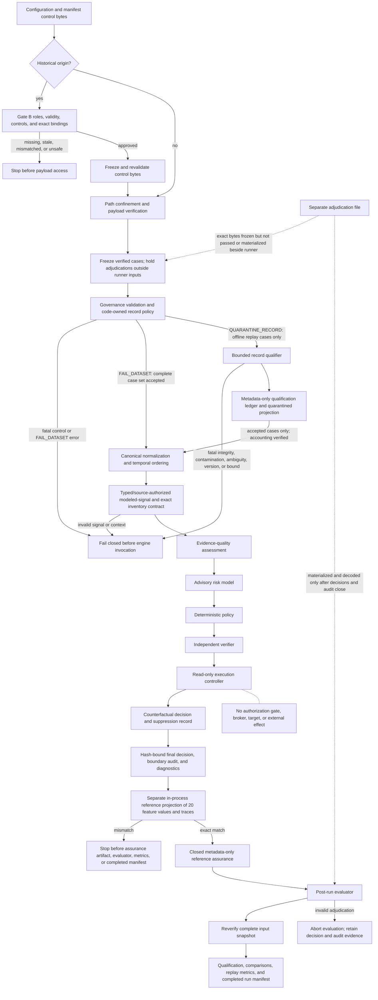

# Phase 2 Architecture

## Purpose and boundary

The Phase 2 architecture adds a governed replay path around the v0.1 evidence, model, policy, and verifier pipeline. It does not extend the action surface. In the built-in runner and canonical adapter, historical replay and shadow mode terminate at a recorded counterfactual decision; the tested read-only path does not construct an authorization gate, broker, or target.

The current repository uses local synthetic fixtures only. `historical_case_count` is `0`, there is no approved Gate B package or live-feed adapter, and there are no production credentials or connectors. Phase 2.4 adds exact modeled-signal typing/source authorization, exact four-field inventory binding, and a separately implemented in-process reference projection of serialized feature values and traces. It does not authorize a historical pilot or advance the architecture to live or shadow-feed deployment.

## Logical flow



## Component allocation

| Component | Allocation | Phase 2 responsibility |
|---|---|---|
| Execution mode | `src/adf_poc/execution.py` | Define `historical_replay` and `shadow_read_only`; reject unknown or effect-capable modes |
| Replay contracts | `contracts/v0.2.0/` and `src/adf_poc/replay/contracts.py` | Validate versions, structure, semantics, governance, and prohibited label fields |
| Structured decision-input contract | `src/adf_poc/feature_contract.py`, replay case schema, and qualification | Require exact types/ranges, code-authorized sources, finite JSON numbers, exact canonical inventory binding, and a network-only Boolean `source_conflict`; unrecognized attributes remain feature-opaque |
| Reference feature projector | `src/adf_poc/replay/reference_features.py` | Separately reconstruct the 20 feature values and event traces from normalized cases and compare them with serialized decisions without importing the production calculation path |
| Reference-assurance contract | `contracts/v0.2.0/reference-feature-assurance.schema.json` | Permit one closed metadata-only matched row per case; raw values and free-form errors are excluded |
| Gate B preflight | `contracts/v0.2.0/gate-b-authorization.schema.json` and `src/adf_poc/replay/gate_b.py` | Require current external-role assertions, exact artifact bindings, restricted paths, frozen scope/thresholds, and sanitized outputs before historical payload access |
| Record qualifier | `src/adf_poc/replay/qualification.py` | Qualify bounded case JSONL, sanitize outcomes, preserve exact source-occurrence metadata, and abort on code-owned fatal conditions |
| Local snapshot adapter | `src/adf_poc/replay/adapters.py` | Read manifest-referenced local JSONL only; no network or vendor client |
| Normalizer | `src/adf_poc/replay/normalizer.py` | Produce canonical cases, retain mapping warnings, and sort valid events deterministically |
| Replay harness | `src/adf_poc/replay/harness.py` | Freeze and reverify Gate B and replay inputs; independently validate qualification accounting; withhold adjudication files from the runner; enforce decision/audit binding, decision-only execution, safety checks, and artifact generation |
| Audit validator | `src/adf_poc/audit.py` and `src/adf_poc/replay/harness.py` | Reject ambiguous JSON and require the exact canonical eight-stage per-case trace, sequence/time rules, decision bindings, suppression content, and policy action list |
| Gate B campaign | `config/gate_b_ce2_campaign_plan.json`, `scripts/generate_gate_b_ce2_campaign.py`, and `evidence/phase2_gate_b_ce2/` | Bind fixed synthetic scenarios and expected outcomes to an implementation commit; capture only sanitized enumerated outcomes and declared boundary instrumentation |
| Feature-assurance campaign | `config/feature_assurance_ce2_campaign_plan.json`, `contracts/v0.2.0/feature-assurance-ce2-campaign.schema.json`, and `evidence/phase2_feature_assurance_ce2/` | Bind the fixed `P2-CE-004` matrix and output shapes to corrected Commit `53e409d6`; preserve two complete sanitized ledgers and the narrow SELF-reviewed CE-2 result |
| Replay metrics | `src/adf_poc/replay/metrics.py` | Report scope, disposition, qualification, rejection-reason, adjudication-comparison, and read-only assurance measures |
| Phase 1 engine | `src/adf_poc/engine.py` | Supply evidence, model, policy, and verifier behavior under an explicit execution boundary |
| Command entry point | `run_phase2.py` | Expose only read-only Phase 2 modes and local paths |
| Starter fixture | `data/phase2_starter/` | Exercise the framework with synthetic records and `historical_case_count: 0` |
| Qualification fixture | `data/phase2_qualification/` | Predeclare seven synthetic source occurrences: three accepted and four quarantined; no historical records |

## Execution boundary

Phase 1 simulation includes an authorization gate, an action broker, and an in-memory identity target. Phase 2 read-only modes must bypass that branch structurally rather than rely on an empty action list or operator intent.

The intended execution controller has three relevant properties:

1. Phase 1 synthetic simulation remains an explicit, separate mode for the existing POC.
2. Replay and shadow modes do not construct or receive an authorization gate, broker, target, or action credential.
3. A policy proposal may retain `CONTAIN_REVERSIBLE`, but proposed actions are copied only to `counterfactual_actions`; the execution record shows that authorization and effects were suppressed.

An illustrative decision fragment is:

```json
{
  "execution_mode": "historical_replay",
  "counterfactual_actions": ["revoke_active_sessions"],
  "proposal": {
    "executable_actions": []
  },
  "authorization": {
    "issued": false,
    "token_id": "",
    "decision_hash": "",
    "permitted_actions": [],
    "error": ""
  },
  "action_results": [],
  "post_action_verification": {
    "applicable": false,
    "status": "NOT_APPLICABLE",
    "passed": null,
    "checks": []
  },
  "execution_control": {
    "mode": "historical_replay",
    "read_only": true,
    "status": "SUPPRESSED_READ_ONLY",
    "authorization_attempted": false,
    "broker_invocations": 0,
    "operational_effects": 0
  }
}
```

The `final_disposition` remains a counterfactual policy result for compatibility. It must not be interpreted as an executed containment.

## Trust boundaries

### 1. Gate B authority and custody boundary

For historical origin, the runtime reads only configuration, manifest control bytes, the Gate B document, model, policy, and three bound control artifacts until preflight succeeds. Five exact approval roles and an independent review must be present and current; bytes, versions, counts, windows, and safety-control states must match. Restricted control inputs must reside under ignored `local/gate_b/`. The runtime creates an owner-only `outputs/replay/<run>/` directory and retains descriptor-bound authority for every historical write; path substitution cannot redirect a write to a replacement target, and any broken `outputs/replay/run/input_snapshot` descendant binding fails the run. These checks establish machine conformance and byte binding only; they do not authenticate an approver, signature, legal authority, de-identification result, or custody assertion. A same-user process can still relocate or inspect the retained repository tree and therefore remains outside this application-level custody argument.

### 2. Dataset boundary

Replay inputs are untrusted. Every declared file must pass path, digest, count, distinct-file, and bounded-read checks and then be frozen. In the historical path, qualification consumes frozen case bytes and the decision runner receives only in-memory accepted cases plus the bound model and policy byte strings. It receives no filesystem, output, snapshot, or adjudication path. Historical outputs and snapshots are written and reread through retained directory descriptors; their digests and counts are rechecked after execution and before finalization. Governance checks and the selected code-owned record policy run before the engine. Adjudication semantics are evaluated only after decisions and boundary-audit validation close. A manifest is evidence about a dataset, not a trust anchor; its approval and digest provenance must be established outside the mutable replay directory for approved historical work.

Authorization validity is rechecked before historical payload access, before and after the runner, and before final evidence completion. Governed JSON rejects duplicate object members rather than applying ambiguous last-member-wins parsing.

### 3. Qualification and accounting boundary

`FAIL_DATASET` preserves complete-case-set validation. `QUARANTINE_RECORD` is a separate, cases-only policy available only for offline `HISTORICAL_REPLAY`. It produces a closed metadata-only record for every nonblank source occurrence and an exact quarantined projection. The harness rereads the frozen source and independently verifies line ordinals, raw-line digests, schema conformance, one run identity, `input = accepted + quarantined`, and `accepted = decisions`.

Rejected payload, source identifiers extracted from payload, exception text, and free-form error messages never enter the ledger. Source-read failure, integrity mismatch, invalid encoding, oversized lines, unsupported record versions, runtime-label contamination, duplicate identifiers, record-count overflow, and unmapped validator failures abort the complete call. This boundary prevents silent record loss; it does not make accepted records true or representative.

### 4. Modeled-signal and canonical-context boundary

Phase 2.4 permits a modeled attribute only when its JSON type and source type match the code-owned matrix. `failed_logins` must be a finite integral JSON number in `0..1,000,000`; Boolean and string coercion, fractions, negatives, and over-bound values are rejected. Every JSON numeric value anywhere in an accepted case must be finite before engine invocation. Unrecognized attributes remain feature-opaque and cannot enter the model projection.

`source_conflict` is explicitly governed outside the 20-feature vector because it can change evidence-quality assessment and the downstream decision. It must be an exact JSON Boolean asserted only by `network`. Under `QUARANTINE_RECORD`, a wrong-source assertion is `SEMANTICS / UNAUTHORIZED_DECISION_SIGNAL` and a non-Boolean network assertion is `SEMANTICS / INVALID_BOOLEAN`. Reference feature agreement does not validate this input or the broader evidence-quality path.

Every asset-inventory event must assert `asset_id`, `privilege_level`, `break_glass`, and `asset_criticality`, and each must exactly match the canonical case context. Missing or contradictory context rejects the record; the runtime does not vote across inventory events, choose the less restrictive value, coerce types, or infer a default. This binds the feature trace to the canonical context but does not prove that the source assertion is authentic, truthful, or complete.

### 5. Reference-projection boundary

After read-only decision validation, deterministic decision serialization, and the complete eight-stage audit check, the harness calls a separately implemented in-process projector. The reference implementation uses the normalized cases and serialized decisions but imports none of the production feature extractor, feature-contract implementation, engine, model, policy, verifier, harness, or metrics modules. It reconstructs only the 20 feature values and event traces.

On exact agreement, the harness writes one closed metadata-only row per case containing the case identifier, normalized-case digest, expected/observed projection digests, and `matched=true`. Metrics report checked/matched/mismatched/completeness counts, and the completed run manifest binds the artifact digest and count. On mismatch, the call raises a stable code-owned error before the assurance artifact, qualification/rejection publication, adjudication loading, comparisons, metrics, or completed run manifest. Raw, normalized, and deterministic decisions plus the audit may already exist and must be handled as incomplete evidence.

This is diverse implementation logic inside the same process and project, not external independence, separate custody, or an oracle for source truth, evidence quality, model probability, policy, disposition, or verifier correctness.

### 6. Label boundary

Runtime evidence envelopes cannot contain compromise labels, expected dispositions, ground truth, or adjudications. Exact adjudication bytes may be frozen in harness memory for integrity, but no adjudication path or file is passed to or placed beside the historical runner before decision and audit closure. The harness writes the adjudication snapshot through its retained directory descriptor and semantically decodes it only afterward. The single process is not an OS security boundary against arbitrary introspective code, and historical review outcomes are adjudications with uncertainty, not automatically ground truth.

### 7. Decision-to-effect boundary

The built-in replay and shadow outputs contain recommendations and evidence traces only. The read-only engine construction has no route to the Phase 1 authorization gate or simulator and the canonical adapter has no external-system interface. This boundary is tested with exact empty authorization state, zero-token, zero-broker, zero-effect, and no-action-audit assertions. The single Python process is not an OS-enforced sandbox for arbitrary imported code; extensions require a separate trust and isolation argument.

### 8. Audit boundary

The current audit design is a SHA-256-linked consistency chain. For every accepted case, the harness requires exactly one row in this order: `CASE_RECEIVED`, `EVIDENCE_ASSESSED`, `MODEL_ASSESSED`, `POLICY_PROPOSED`, `INDEPENDENTLY_VERIFIED`, `EXECUTION_SUPPRESSED`, `AUTHORIZATION_EVALUATED`, and `DECISION_FINALIZED`. It rejects additional row or payload fields, missing or duplicate stages, cross-case reordering, invalid sequence or timestamp state, non-code-owned suppression content, action lists inconsistent with the exact frozen policy, and finalization identifiers or hashes inconsistent with the serialized decision.

This is CE-1 implementation-conformance evidence for the named code and tested mutation set. It confirms internal agreement among the presented audit rows, decisions, and bound policy-action list; it does not independently recompute evidence-quality, model, complete policy, verifier, or source-to-decision correctness. The timestamps are not externally trusted, and the chain is not independently signed, WORM-protected, OS-anchored, or resistant to wholesale replacement and recomputation by a writer. Phase 2 must preserve these limitations beside any `audit_chain_valid=true` result.

## Validation and failure behavior

| Condition | Required behavior |
|---|---|
| Unsupported manifest or case-contract version | Reject before decision processing |
| Absolute path, parent traversal, or resolved path outside manifest directory | Abort before reading the declared file content |
| File digest or declared record-count mismatch | Abort the complete run |
| Source input changes during processing | Continue only from the verified run snapshot; abort if any snapshot digest/count changes |
| Missing approval or de-identification attestation for a historical dataset | Abort before engine invocation |
| Missing, non-`APPROVED`, expired, malformed, unbound, or unsafe Gate B package | Abort before opening, hashing, counting, decoding, or parsing historical payloads |
| Gate B authorization expires at a later processing boundary | Stop before the next protected stage and do not emit a completed run manifest |
| Gate B package or protocol path outside ignored `local/gate_b/`, or historical output outside `outputs/replay/<run>/` | Reject before historical payload access |
| Accepted case outside the approved window, unknown quarantine category, or observed rate above a frozen threshold | Abort after qualification but before normalization or engine invocation |
| Gate B/control snapshot mutation or inaccessible owner-only snapshot | Abort with a sanitized error; never fall back to original mutable control bytes |
| `QUARANTINE_RECORD` requested for `SHADOW_READ_ONLY` or a role other than `cases` | Reject configuration before qualification |
| Invalid UTF-8, oversized line, unsupported case version, or label/adjudication embedded in runtime input | Abort the complete qualification call with a sanitized fatal code |
| Duplicate JSON object member in a governed control, case, or adjudication record | Reject the ambiguous record; never apply last-member-wins semantics |
| Duplicate case or event identifier | Abort the complete qualification call; do not make acceptance depend on source order |
| Malformed JSON, missing/extra ordinary field, invalid timestamp/type/enum/range, case/event mismatch, or unsafe canonical context under `QUARANTINE_RECORD` | Emit one metadata-only quarantined record and continue only after complete accounting succeeds |
| The same record-local defect under `FAIL_DATASET` | Abort the declared case set before engine invocation |
| Qualification ledger, source-occurrence hash, count, status, or rejection-projection mismatch | Abort before engine invocation |
| Qualification accepts zero cases | Abort rather than emit an empty replay result |
| Valid but out-of-order events | Sort by the canonical key and preserve `EVENT_ORDER_NORMALIZED` diagnostics |
| Modeled attribute has an invalid type/range or appears under an unauthorized source | Fail the dataset or emit a code-owned record-local quarantine under the selected offline policy; never coerce or silently treat it as opaque |
| Non-finite JSON number occurs anywhere in a case, including an opaque attribute | Reject before engine invocation; never allow nonstandard numeric semantics to reach evidence, model, or policy code |
| `source_conflict` is not a JSON Boolean or is asserted outside `network` | Fail/quarantine under the selected offline policy before evidence assessment |
| Asset-inventory event omits or disagrees on canonical `asset_id`, `privilege_level`, `break_glass`, or `asset_criticality` | Reject before feature extraction; never infer, vote, or choose a permissive value |
| Unknown execution mode or action-enabling configuration | Fail closed before engine construction |
| Policy proposes containment in a read-only mode | Record counterfactual actions and suppress authorization and execution |
| Audit row contains an unknown record type | Reject the decision/audit evidence boundary |
| Missing, duplicate, reordered, malformed, or extra-field eight-stage audit record; invalid sequence/time; forged suppression/policy action; or mismatched final decision/hash | Abort before completed run evidence is emitted |
| Reference feature value/trace, case set, normalized-case binding, or projection digest mismatch | Abort before reference assurance, qualification/rejection publication, adjudication loading, comparisons, metrics, or completed manifest; retain any earlier decision/audit files only as incomplete evidence |
| Malformed or inconsistent adjudication | Abort post-run evaluation before comparisons, metrics, or completed run manifest; retain decision and audit evidence |

## Deployment view

The current code is an offline, single-host development harness. `shadow_read_only` is a semantic execution mode, not a deployed service and not a connection to live telemetry. `QUARANTINE_RECORD` is intentionally unavailable in that mode. Any Phase 3 live shadow deployment requires a separately approved architecture with a read-only service identity, network and tenant controls, data-retention rules, ingestion stop conditions, monitoring, and incident response. Phase 2.4 provides no evidence that those gates are met, and none of those future controls grants action authority.

## Architectural nonclaims

The starter does not demonstrate process isolation between policy and verification, sandboxing against arbitrary same-process code, cryptographic evidence provenance, externally anchored audit custody, privacy effectiveness, vendor semantics, production-scale availability, agentic alignment/misalignment or sabotage-robustness behavior, monitor effectiveness, or safe operational action. Phase 2.4 separately checks only feature values and traces; its `P2-CE-004` SELF-reviewed synthetic result does not prove source truth, full source-to-decision correctness, model probability, policy/disposition correctness, external custody, external independence, exhaustive coverage, a bounded failure rate, or production readiness. `P2-CE-003` additionally does not establish a real approval, actual historical-data handling, OS-level nonaccess/non-egress, target-side effect proof, independent replication, or efficacy. Those are future validation obligations, not implicit capabilities.
