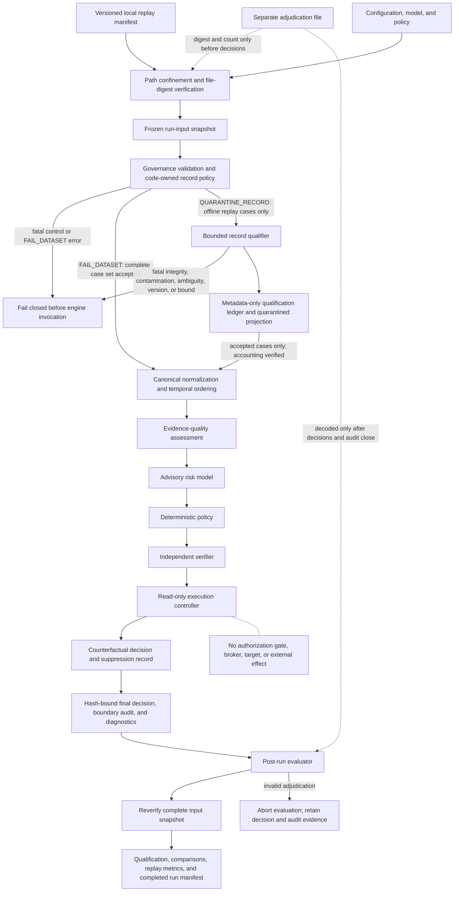

# Phase 2 Architecture

## Purpose and boundary

The Phase 2 architecture adds a governed replay path around the v0.1 evidence, model, policy, and verifier pipeline. It does not extend the action surface. In the built-in runner and canonical adapter, historical replay and shadow mode terminate at a recorded counterfactual decision; the tested read-only path does not construct an authorization gate, broker, or target.

The current code uses local synthetic fixtures only. `historical_case_count` is `0`, there is no live-feed adapter, and there are no production credentials or connectors. Phase 2.1 adds bounded offline record qualification; it does not advance the architecture to a live or shadow-feed deployment.

## Logical flow



## Component allocation

| Component | Allocation | Phase 2 responsibility |
|---|---|---|
| Execution mode | `src/adf_poc/execution.py` | Define `historical_replay` and `shadow_read_only`; reject unknown or effect-capable modes |
| Replay contracts | `contracts/v0.2.0/` and `src/adf_poc/replay/contracts.py` | Validate versions, structure, semantics, governance, and prohibited label fields |
| Record qualifier | `src/adf_poc/replay/qualification.py` | Qualify bounded case JSONL, sanitize outcomes, preserve exact source-occurrence metadata, and abort on code-owned fatal conditions |
| Local snapshot adapter | `src/adf_poc/replay/adapters.py` | Read manifest-referenced local JSONL only; no network or vendor client |
| Normalizer | `src/adf_poc/replay/normalizer.py` | Produce canonical cases, retain mapping warnings, and sort valid events deterministically |
| Replay harness | `src/adf_poc/replay/harness.py` | Freeze and reverify inputs; independently validate qualification accounting; enforce deferred adjudication decoding, decision/audit binding, decision-only execution, safety checks, and artifact generation |
| Replay metrics | `src/adf_poc/replay/metrics.py` | Report scope, disposition, qualification, rejection-reason, adjudication-comparison, and read-only assurance measures |
| Phase 1 engine | `src/adf_poc/engine.py` | Supply evidence, model, policy, and verifier behavior under an explicit execution boundary |
| Command entry point | `run_phase2.py` | Expose only read-only Phase 2 modes and local paths |
| Starter fixture | `data/phase2_starter/` | Exercise the framework with synthetic records and `historical_case_count: 0` |
| Qualification fixture | `data/phase2_qualification/` | Predeclare seven synthetic source occurrences: three accepted and four quarantined; no historical records |

## Execution boundary

Phase 1 simulation includes an authorization gate, an action broker, and an in-memory identity target. Phase 2 read-only modes must bypass that branch structurally rather than rely on an empty action list or operator intent.

The intended execution controller has three relevant properties:

1. Phase 1 synthetic simulation remains an explicit, separate mode for the existing POC.
2. Replay and shadow modes do not construct or receive an authorization gate, broker, target, or action credential.
3. A policy proposal may retain `CONTAIN_REVERSIBLE`, but proposed actions are copied only to `counterfactual_actions`; the execution record shows that authorization and effects were suppressed.

An illustrative decision fragment is:

```json
{
  "execution_mode": "historical_replay",
  "counterfactual_actions": ["revoke_active_sessions"],
  "proposal": {
    "executable_actions": []
  },
  "authorization": {
    "issued": false,
    "token_id": "",
    "decision_hash": "",
    "permitted_actions": [],
    "error": ""
  },
  "action_results": [],
  "post_action_verification": {
    "applicable": false,
    "status": "NOT_APPLICABLE",
    "passed": null,
    "checks": []
  },
  "execution_control": {
    "mode": "historical_replay",
    "read_only": true,
    "status": "SUPPRESSED_READ_ONLY",
    "authorization_attempted": false,
    "broker_invocations": 0,
    "operational_effects": 0
  }
}
```

The `final_disposition` remains a counterfactual policy result for compatibility. It must not be interpreted as an executed containment.

## Trust boundaries

### 1. Dataset boundary

Replay inputs are untrusted. Every declared file must pass path, digest, count, and bounded-read checks and then be copied into a run-owned snapshot. The engine and evaluator load only snapshot bytes, whose digests and counts are rechecked after execution and before finalization. Governance checks and the selected code-owned record policy run before the engine. Adjudication semantics are evaluated only after decisions and boundary-audit validation close. A manifest is evidence about a dataset, not a trust anchor; its approval and digest provenance must be established outside the mutable replay directory for approved historical work.

### 2. Qualification and accounting boundary

`FAIL_DATASET` preserves complete-case-set validation. `QUARANTINE_RECORD` is a separate, cases-only policy available only for offline `HISTORICAL_REPLAY`. It produces a closed metadata-only record for every nonblank source occurrence and an exact quarantined projection. The harness rereads the frozen source and independently verifies line ordinals, raw-line digests, schema conformance, one run identity, `input = accepted + quarantined`, and `accepted = decisions`.

Rejected payload, source identifiers extracted from payload, exception text, and free-form error messages never enter the ledger. Source-read failure, integrity mismatch, invalid encoding, oversized lines, unsupported record versions, runtime-label contamination, duplicate identifiers, record-count overflow, and unmapped validator failures abort the complete call. This boundary prevents silent record loss; it does not make accepted records true or representative.

### 3. Canonical-context boundary

V0.1 trusts top-level `break_glass` and `asset_criticality` values. Phase 2 therefore requires cross-field validation against authoritative asset-inventory evidence. Missing or contradictory safety-critical context rejects the record; it is not resolved by choosing the less restrictive value.

### 4. Label boundary

Runtime evidence envelopes cannot contain compromise labels, expected dispositions, ground truth, or adjudications. A separate evaluator may load adjudications only after decision output is closed. Historical review outcomes are adjudications with uncertainty, not automatically ground truth.

### 5. Decision-to-effect boundary

The built-in replay and shadow outputs contain recommendations and evidence traces only. The read-only engine construction has no route to the Phase 1 authorization gate or simulator and the canonical adapter has no external-system interface. This boundary is tested with exact empty authorization state, zero-token, zero-broker, zero-effect, and no-action-audit assertions. The single Python process is not an OS-enforced sandbox for arbitrary imported code; extensions require a separate trust and isolation argument.

### 6. Audit boundary

The current audit design is a SHA-256-linked consistency chain. The harness also requires exactly one suppression, no-authorization, and decision-finalization record per case; it recomputes each decision hash and cross-checks the finalization payload. These checks detect ordinary modification and incomplete local evidence when verified against an unchanged chain, but the chain is not externally signed, WORM-protected, or resistant to wholesale recomputation by a writer. Phase 2 must preserve this limitation in reports and cannot use `audit_chain_valid=true` as proof of independent custody.

## Validation and failure behavior

| Condition | Required behavior |
|---|---|
| Unsupported manifest or case-contract version | Reject before decision processing |
| Absolute path, parent traversal, or resolved path outside manifest directory | Abort before reading the declared file content |
| File digest or declared record-count mismatch | Abort the complete run |
| Source input changes during processing | Continue only from the verified run snapshot; abort if any snapshot digest/count changes |
| Missing approval or de-identification attestation for a historical dataset | Abort before engine invocation |
| `QUARANTINE_RECORD` requested for `SHADOW_READ_ONLY` or a role other than `cases` | Reject configuration before qualification |
| Invalid UTF-8, oversized line, unsupported case version, or label/adjudication embedded in runtime input | Abort the complete qualification call with a sanitized fatal code |
| Duplicate case or event identifier | Abort the complete qualification call; do not make acceptance depend on source order |
| Malformed JSON, missing/extra ordinary field, invalid timestamp/type/enum/range, case/event mismatch, or unsafe canonical context under `QUARANTINE_RECORD` | Emit one metadata-only quarantined record and continue only after complete accounting succeeds |
| The same record-local defect under `FAIL_DATASET` | Abort the declared case set before engine invocation |
| Qualification ledger, source-occurrence hash, count, status, or rejection-projection mismatch | Abort before engine invocation |
| Qualification accepts zero cases | Abort rather than emit an empty replay result |
| Valid but out-of-order events | Sort by the canonical key and preserve `EVENT_ORDER_NORMALIZED` diagnostics |
| Unknown execution mode or action-enabling configuration | Fail closed before engine construction |
| Policy proposes containment in a read-only mode | Record counterfactual actions and suppress authorization and execution |
| Missing, duplicate, or mismatched decision-finalization audit record | Abort before completed run evidence is emitted |
| Malformed or inconsistent adjudication | Abort post-run evaluation before comparisons, metrics, or completed run manifest; retain decision and audit evidence |

## Deployment view

The current code is an offline, single-host development harness. `shadow_read_only` is a semantic execution mode, not a deployed service and not a connection to live telemetry. `QUARANTINE_RECORD` is intentionally unavailable in that mode. Any Phase 3 live shadow deployment requires a separately approved architecture with a read-only service identity, network and tenant controls, data-retention rules, ingestion stop conditions, monitoring, and incident response. Phase 2.1 provides no evidence that those gates are met, and none of those future controls grants action authority.

## Architectural nonclaims

The starter does not demonstrate process isolation between policy and verification, sandboxing against arbitrary same-process code, cryptographic evidence provenance, externally anchored audit custody, privacy effectiveness, vendor semantics, production-scale availability, agentic alignment, monitor effectiveness, or safe operational action. Those are future validation obligations, not implicit capabilities.
